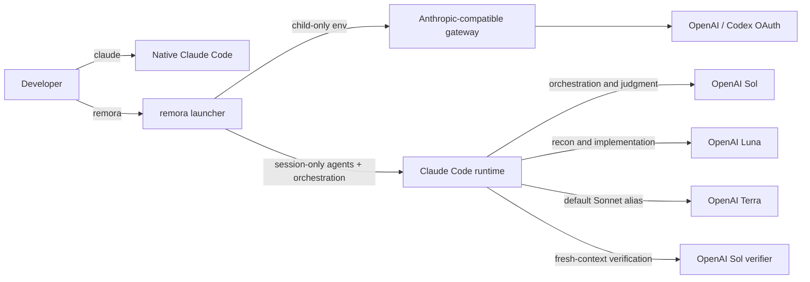

# remora

> Run Claude Code with a cost-aware GPT-5.6 agent fleet.

**remora** attaches OpenAI GPT-5.6 models to Claude Code for one session. Sol plans, orchestrates, and verifies critical work; Luna handles exploration and implementation at lower cost; Terra provides a balanced everyday switch. Claude Code remains the interface, tool runtime, and agent orchestrator. Like the fish it is named after, remora leaves its host unchanged when the session ends.

[繁體中文](./README.zh-TW.md)

## Contents

- [What it changes](#what-it-changes)
- [Architecture](#architecture)
- [Model map](#model-map)
- [Who it is for](#who-it-is-for)
- [Trust and security](#trust-and-security)
- [Requirements](#requirements)
- [Install](#install)
- [Configure](#configure)
- [Use](#use)
- [Verify isolation](#verify-isolation)
- [Questions and answers](#questions-and-answers)
- [Operational notes](#operational-notes)
- [Operational security](#operational-security)
- [Uninstall](#uninstall)
- [Prior art](#prior-art)

## What it changes

remora launches a child `claude` process with a session-only `--agents` JSON document, a session-only orchestration addendum, and a child-only gateway environment. Claude Code officially documents `--agents` as a current-session source that outranks project and user agent files without persisting them. The addendum schedules independent work in the background and reserves foreground agents for immediate blocking dependencies.

| Surface | Native `claude` | `remora` session |
|---|---|---|
| Command | Unchanged | Separate executable |
| Anthropic login | Unchanged | Replaced only in the child environment |
| `~/.claude/settings.json` | Never written | Still readable by Claude Code |
| Additional settings | None | Child-only model allowlist passed with `--settings` |
| `~/.claude/agents/` | Never written | Session agents take precedence by name |
| Project `.claude/` | Never written | Continues to load normally |
| Shell aliases/functions | Never written | None required |
| Runtime marker | Absent | `REMORA_ACTIVE=1` in the child only |

> **Core guarantee:** quitting remora ends every override. Running `claude` afterward uses the same command, credentials, settings, and agents it used before installation.

## Architecture



The launcher is intentionally not a proxy and stores no OAuth credentials. Bring an Anthropic-compatible gateway such as [CLIProxyAPI](https://github.com/router-for-me/CLIProxyAPI), then point remora at it. See [the architecture rationale](./docs/architecture.md) and [gateway runbook](./docs/cliproxyapi.md).

## Model map

The defaults mirror the working GPT-5.6 split that motivated this repository. Every name is configurable because gateways expose different model catalogs.

Claude Code's built-in aliases remain useful escape hatches: Opus defaults to Sol, Sonnet to Terra, and Haiku to Luna.

Claude Code validates subagent models against `availableModels`. If a user's normal settings list only Claude aliases, a raw gateway id such as `gpt-5.6-luna` is otherwise rejected and silently inherits the Sol main model. remora prevents that fallback by passing a child-only additional settings document that allowlists every configured gateway model. It does not write or replace the user's settings file, and managed organization policy still retains its normal higher precedence.

The role definition is the only model source for a named agent. remora's orchestration policy therefore forbids passing `model` when invoking `Explore`, `scout`, `mech-executor`, `executor`, `verifier`, `security-executor`, or any other existing named role: Claude Code gives an invocation-level model higher precedence and would bypass the role map. Only a truly ad-hoc agent with no role definition receives an explicit invocation model.

| Role | Default model | Effort | Responsibility |
|---|---|---:|---|
| Main session | `gpt-5.6-sol` | User-selected | Plan, decide, integrate |
| `Explore` | `gpt-5.6-luna` | low | Broad read-only search |
| `scout` | `gpt-5.6-luna` | low | Focused reconnaissance |
| `mech-executor` | `gpt-5.6-luna` | medium | Fully specified mechanical work |
| `executor` | `gpt-5.6-luna` | max | Cost-efficient implementation with deeper reasoning |
| `verifier` | `gpt-5.6-sol` | high | Independent adversarial verification |
| `security-executor` | `gpt-5.6-sol` | max | Security-sensitive work |

### Context safety

OpenAI's public GPT-5.6 API advertises a 1.05M context window, and CLIProxyAPI's Codex OAuth catalog currently reports 372K for Sol, Terra, and Luna. The Codex runtime catalog is a separate, later authority: a 2026-07-13 hot update changed those models to 272K even though the bundled Codex catalog and CLIProxyAPI metadata still said 372K. remora therefore never assumes that the public API or gateway number is the client ceiling.

Claude Code assigns unknown custom model ids a 200K context window. remora therefore defaults to `stock` mode: a truthful 200K client window with Claude's native compact pipeline left untouched. Native Claude may compact before the displayed limit because it separately reserves output tokens and precomputes summaries; remora does not report a made-up exact trigger for this mode.

Users who explicitly install [Calico Claude](https://github.com/Nanako0129/calico-claude) can select `calico` mode. remora reads both the gateway catalog and a fresh Codex `models_cache.json`, then uses the smaller per-model value. If the Codex cache is unavailable, stale, or incomplete, a configurable 272K safe fallback becomes the ceiling. The current 272K runtime window therefore appears as 258.4K usable context and compacts at 244.8K, matching Codex's 95% display and 90% compact defaults. If a later fresh runtime catalog restores 372K, remora restores 372K too; the fallback is not a permanent pin. Malformed maps, unknown ids, and missing Calico patches fail closed.

| Mode | Claude binary | Display window | Compact trigger | Default |
|---|---|---:|---:|---|
| `stock` | Official native Claude Code | 200K | Claude-managed | Yes |
| `calico` | Verified Calico release | 95% of the smaller gateway/Codex window | 90% of the smaller gateway/Codex window | Explicit opt-in |

```toml
[context]
mode = "stock"
stock_window = 200000
discovery = true
fallback_window = 372000
codex_fallback_window = 272000
codex_cache_ttl_seconds = 300
effective_window_percent = 95
auto_compact_percent = 90
```

To opt in after installing a Calico release that contains `custom-context-window`, change only `mode = "calico"` and run `remora doctor --online` before starting work.

## Who it is for

remora is for developers who prefer Claude Code's interaction model but want their coding work executed by a tiered GPT-5.6 fleet. It is especially useful when a single frontier model for every subtask is unnecessarily expensive.

| Good fit | Need remora addresses |
|---|---|
| Claude Code power users | Keep Claude Code tools, permissions, hooks, project instructions, and session continuation while using OpenAI models |
| Codex/OpenAI subscribers | Use an existing OpenAI OAuth-backed gateway from the Claude Code interface |
| Multi-agent developers | Assign planning, reconnaissance, implementation, verification, and security work to distinct model/effort tiers |
| Cost-conscious teams and solo builders | Reserve Sol for judgment and verification while Luna max performs routine implementation |
| Home-lab operators | Connect to an existing self-hosted CLIProxyAPI deployment without embedding gateway management into the launcher |
| Anthropic and OpenAI users | Switch with `claude` and `remora` instead of replacing native Claude configuration |

remora is not a hosted gateway, an OAuth account manager, an official OpenAI or Anthropic integration, or a zero-trust sandbox. It is a poor fit where organizational policy prohibits model gateways or where only vendor-supported routing is acceptable.

## Trust and security

> Installation is approval-gated, release artifacts are verifiable, and runtime overrides are confined to the remora child process.

| Guarantee | Enforcement |
|---|---|
| Read before write | The one-prompt runbook requires a read-only preflight and complete change plan before approval |
| Immutable source | Recommended prompts reference a release tag; every fetched installer file must use the same tag |
| Verifiable release | Bootstrap requires SHA-256 and GitHub artifact attestation; checksum-only mode needs an explicit downgrade |
| No blind overwrite | Installer refuses unrelated executables and preserves existing user configuration |
| Native Claude isolation | Installer and launcher never write `~/.claude`, replace `claude`, or read the Anthropic login |
| Secret minimization | Gateway tokens come from an environment variable or direct credential command and are never printed |
| Reversible scope | Only three remora-owned locations are installed; uninstall does not touch native Claude |

The gateway and upstream model still receive prompts and any source Claude Code sends them. Review the full [security policy](./SECURITY.md) and [gateway trust boundary](./docs/cliproxyapi.md) before using remora on sensitive repositories.

## Requirements

| Dependency | Requirement |
|---|---|
| Claude Code | A version supporting dynamic `--agents` definitions |
| Python | 3.11 or newer; standard library only |
| Gateway | Anthropic Messages-compatible base URL with the configured model names |
| Platform | macOS or Linux; WSL should work but is not yet tested |
| Authentication | Gateway token in an environment variable or OS credential-store command |

## Install

### Approval-gated one-prompt install

Give Claude Code this prompt. The immutable tag is intentional:

```text
Read and follow this installation runbook:
https://raw.githubusercontent.com/Nanako0129/remora-cc/v0.1.7/install/AGENT-INSTALL.md

Perform only the read-only preflight first. Show every proposed filesystem
change, trust boundary, download source, and verification step. Do not write
anything until I explicitly approve.
```

The runbook will not ask for a bearer token or OAuth file. It stops at an approval gate, downloads the matching release, verifies its SHA-256 and GitHub attestation, installs atomically, and checks that `~/.claude` did not change.

### Manual source install

```bash
git clone --branch v0.1.7 --depth 1 https://github.com/Nanako0129/remora-cc.git
cd remora-cc
./install.sh
```

The installer copies remora under the XDG data directory, creates a configuration only when none exists, and links one new executable:

```text
~/.local/bin/remora
~/.local/share/remora-cc/
~/.config/remora-cc/config.toml
```

It does not add the bin directory to `PATH`. If needed, add this to your shell profile yourself:

```bash
export PATH="$HOME/.local/bin:$PATH"
```

## Configure

Need a gateway first? Follow the [minimal CLIProxyAPI Docker Compose deployment](./docs/cliproxyapi.md#quick-docker-compose-deployment), complete Codex OAuth in its GUI, then return here with the proxy API key.

Edit the generated configuration:

```bash
${EDITOR:-vi} ~/.config/remora-cc/config.toml
```

For a quick local test, export the gateway token in the current terminal:

```bash
export REMORA_AUTH_TOKEN='replace-me'
remora doctor --online
```

For daily macOS use, retrieve the token from Keychain instead of storing it in TOML:

```toml
[proxy]
base_url = "http://127.0.0.1:8317"
auth_token_env = "REMORA_AUTH_TOKEN"
auth_token_command = ["security", "find-generic-password", "-a", "YOUR_MACOS_USER", "-s", "cliproxyapi", "-w"]
```

The environment variable wins when present; otherwise remora executes the array directly without a shell and reads the token from stdout.

## Use

Run remora anywhere you would run Claude Code:

```bash
cd ~/src/my-project
remora
remora --continue
remora -p 'summarize this repository'
```

All unrecognized arguments pass through to `claude`. Explicit Claude flags win: supplying your own `--model` or `--agents` prevents remora from injecting that specific default.

Useful diagnostics:

| Command | Result |
|---|---|
| `remora doctor` | Validate binary, configuration, agent rendering, and secret retrieval |
| `remora doctor --online` | Also verify gateway models, context ceilings, and the optional active-turn protocol |
| `remora agents` | Show effective role/model/effort assignments |
| `remora render-agents` | Print the exact JSON supplied through `--agents` |
| `remora dry-run --continue` | Print a token-free launch preview |

## Verify isolation

Before and after installation, these checks should produce identical hashes because remora never writes them:

```bash
find ~/.claude -type f -maxdepth 3 -print0 \
  | sort -z \
  | xargs -0 shasum -a 256 > /tmp/claude-files.sha256

remora dry-run
claude --version
```

The strongest behavioral check is simply to run both commands. `remora agents` should show the OpenAI map; plain `claude` should retain its original model and authentication.

## Questions and answers

| Question | Answer |
|---|---|
| Is remora only a model alias? | No. It supplies a session-scoped agent roster, model allowlist, role-specific effort levels, and gateway environment. The main session, executors, scouts, and verifiers can use different GPT-5.6 tiers. |
| Does remora replace native Claude Code? | No. `remora` launches a child process; plain `claude` keeps its normal settings and authentication. Calico is a separate, explicit opt-in. |
| Is Calico required? | No. `stock` mode works with the official Claude binary and its native 200K custom-model behavior. Calico is required only for Codex-runtime-sized context handling and the optional active-turn identity adapter. |
| Can CLIProxyAPI run on another computer? | Yes. Use a trusted LAN or VPN address in `proxy.base_url`; keep the management UI and OAuth callback behind loopback plus an SSH tunnel. |
| Why can `claude --version` say patched while remora reports a missing Calico adapter? | An older Calico build can retain the branded version patch while lacking newer context or active-turn modules. Claude's updater may also replace a patched version. `remora doctor --online` checks the actual capability markers rather than trusting the label. |
| How do I keep native Claude updates separate from remora's Calico binary? | Install the patched binary under a separate name such as `~/.local/bin/calico-claude`, set `[runtime].claude_binary` to that absolute path, and leave `~/.local/bin/claude` under the official updater. |
| Does active-turn v1 guarantee unlimited work after quota exhaustion? | No. It preserves the observable native Codex turn contract, but OpenAI still controls fair-use and may terminate a recognized turn. v1 advertises readiness only for one local Codex credential with cooling disabled. |
| Will `/resume` adopt a newly edited model map? | Not always. Claude can restore the session-scoped agent definitions recorded in the old transcript. Start a new remora session or hand off into one after changing routing. |
| Can a remora session use claude.ai remote control or connectors? | Gateway mode does not retain the native claude.ai authenticated transport, so those features may be unavailable. Run plain `claude` when they are required. |

## Operational notes

| Symptom | Meaning | Action |
|---|---|---|
| Agent inherits the main model | A global `CLAUDE_CODE_SUBAGENT_MODEL` overrode the agent map | remora clears it in the child by default; confirm with `remora doctor` |
| Every role resolves to the main model | Gateway ids were excluded by Claude Code's `availableModels` | Upgrade to remora 0.1.4; `doctor` must print all configured ids in the routing allowlist |
| Resumed agents still use an old model map | `/resume` restored session-scoped agent definitions from the old transcript | Start a fresh remora session or hand off into a new session after changing routing |
| `All credentials ... are cooling down` | The gateway locally suspended the only credential/model after an upstream 429 | Wait for reset, add failover credentials, lower concurrency, or restart only as a last-resort state reset |
| `Codex active-turn bridge: DEGRADED` | Calico, gateway capability, or the supported one-credential topology is absent | Active work may stop at a quota boundary; follow the experimental gateway runbook or treat stock behavior as expected |
| Models work but names differ | The gateway exposes aliases different from this example | Update `[models]` and `[agent_models]` |
| `Your input exceeds the context window` | The gateway metadata, Codex runtime catalog, and selected client mode disagree | Run Codex once to refresh `~/.codex/models_cache.json`, then run `remora doctor --online`; current Calico output should show `client_window=272000` |
| Native Claude also uses the gateway | Gateway variables were exported globally in the shell | Remove global `ANTHROPIC_*` exports; let remora set them for its child |
| A role is missing | An explicit `--agents` flag replaced remora's dynamic map | Remove that flag or merge the role into your supplied JSON |
| `--settings cannot be combined` | A second additional-settings source would replace remora's routing allowlist | Put persistent settings in the normal Claude settings files and let remora own the session-only `--settings` argument |
| `claude.ai connectors are disabled` warning | Claude Code detected remora's child-only gateway auth instead of the native Claude login | Expected inside remora; run plain `claude` when claude.ai connectors are required |

> ⚠️ **Do not disable gateway cooldown globally as the first fix.** A real upstream rate limit can become a retry storm. The safer order is lower concurrency, bounded retry, multiple credentials, and correct classification of transient versus quota 429 responses.

The experimental active-turn bridge is the narrow exception: v1 deliberately requires one credential with cooling disabled and refuses to advertise support for multi-account or Home routing. See the [gateway runbook](./docs/cliproxyapi.md#experimental-active-turn-bridge).

## Operational security

remora never prints the gateway token, includes no telemetry, and invokes credential-store commands as an argument array without shell expansion. The proxy still receives source code and prompts, and the selected OpenAI account still processes them. Read [SECURITY.md](./SECURITY.md) before using a remote gateway.

## Uninstall

```bash
./uninstall.sh
```

The default keeps the configuration for reinstalling. Remove it too with:

```bash
./uninstall.sh --purge
```

Neither path touches `~/.claude`.

## Prior art

remora packages a narrow technique rather than inventing multi-agent routing. [pilotfish](https://github.com/Nanako0129/pilotfish) established the role-based orchestration pattern; use it when you want to study or customize the global-policy version of this design. Anthropic documents dynamic session agents and custom LLM gateways; [CLIProxyAPI](https://github.com/router-for-me/CLIProxyAPI) supplies the protocol bridge. remora's contribution is one auditable, installable launcher for an existing gateway, with no mutation of native Claude state.

## License

[MIT](./LICENSE)
