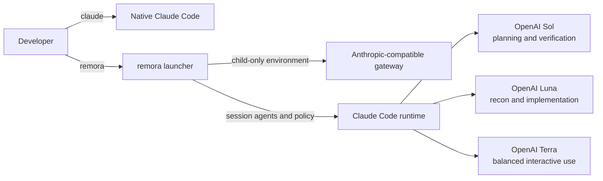

# remora

> Run Claude Code with a cost-aware GPT-5.6 agent fleet for one session.

**remora** launches Claude Code with session-scoped OpenAI model routing,
role agents, and orchestration. Sol handles planning and critical review, Luna
handles lower-cost exploration and implementation, and Terra is the balanced
interactive option. Exiting the child session removes every override.

[繁體中文](./README.zh-TW.md)

## Contents

- [What remora changes](#what-remora-changes)
- [Architecture and model map](#architecture-and-model-map)
- [Requirements](#requirements)
- [Install](#install)
- [Configure](#configure)
- [Use](#use)
- [Isolation and security](#isolation-and-security)
- [Troubleshooting](#troubleshooting)
- [Uninstall](#uninstall)
- [Further reading](#further-reading)

## What remora changes

> **Core guarantee:** plain `claude` keeps its original credentials, settings,
> agents, and model routing. remora changes only the child process it launches.

| Surface | Native `claude` | `remora` session |
| --- | --- | --- |
| Command | Unchanged | Separate `remora` executable |
| Authentication | Existing Anthropic login | Child-only gateway token |
| Settings | Existing Claude hierarchy | Session routing and caller settings |
| Agents | Project/user/plugin agents | Eight session roles |
| Model fallback | Existing behavior | Automatic fallback disabled |
| Files under `~/.claude` | Unchanged | Never written |
| Runtime marker | Absent | `REMORA_ACTIVE=1` in the child |

Large Plans use a reviewed program envelope followed by independently
approvable execution slices. Two automatic `REVISE` verdicts pause only the
affected readiness unit; unrelated `READY` slices may proceed after explicit
approval. By default, the next executable slice is reviewed and presented for
approval before downstream slices. Security-sensitive units require read-only
security evidence before the first Plan review for that unit. The complete contract belongs in
[the architecture document](./docs/architecture.md#role-policy).

## Architecture and model map



remora is a launcher, not a proxy. Bring an Anthropic Messages-compatible
gateway such as [CLIProxyAPI](https://github.com/router-for-me/CLIProxyAPI);
the gateway owns protocol translation, OAuth, retries, cooldown, and billing.

| Role | Default model | Effort | Responsibility |
| --- | --- | ---: | --- |
| Main session | `gpt-5.6-sol` | User-selected | Plan, decide, integrate |
| `Explore` | `gpt-5.6-luna` | low | Broad read-only search |
| `scout` | `gpt-5.6-luna` | low | Focused reconnaissance |
| `plan-verifier` | `gpt-5.6-sol` | medium | Read-only Plan challenge |
| `security-reviewer` | `gpt-5.6-sol` | high | Read-only security evidence |
| `mech-executor` | `gpt-5.6-luna` | medium | Mechanical implementation |
| `executor` | `gpt-5.6-luna` | max | Judgment-heavy implementation |
| `verifier` | `gpt-5.6-sol` | high | Adversarial outcome verification |
| `security-executor` | `gpt-5.6-sol` | max | Approved security implementation |

| Context mode | Claude binary | Client window | Use when |
| --- | --- | ---: | --- |
| `stock` | Official Claude Code | Native 200K custom-model behavior | Default |
| `calico` | Verified Calico | Smaller gateway/Codex value | Explicit opt-in |

Runtime behavior and reference documents:

| Topic | Contract | Reference |
| --- | --- | --- |
| Caller settings | Recursively merged; remora-owned keys remain authoritative | [Isolation contract](./docs/architecture.md#isolation-contract) |
| Fallback | `fallbackModel: []`; CLI `--fallback-model` is rejected | [Isolation contract](./docs/architecture.md#isolation-contract) |
| Wrapper prompts | `REMORA_COMPOSE_SYSTEM_PROMPT=1` composes caller then remora policy | [Role policy](./docs/architecture.md#role-policy) |
| Context and Calico | Fails closed on stale or inconsistent metadata | [Gateway semantics](./docs/architecture.md#gateway-semantics) |
| Active-turn bridge | Experimental and topology-limited | [Gateway runbook](./docs/cliproxyapi.md#experimental-active-turn-bridge) |

## Requirements

| Dependency | Requirement |
| --- | --- |
| Claude Code | A version supporting dynamic `--agents` |
| Python | 3.11 or newer; standard library only |
| Gateway | Anthropic Messages-compatible endpoint with the configured models |
| Platform | macOS or Linux; WSL is not yet tested |
| Authentication | Environment variable or OS credential-store command |

## Install

### Approval-gated install

Give Claude Code this immutable-tag runbook:

```text
Read and follow this installation runbook:
https://raw.githubusercontent.com/Nanako0129/remora-cc/v0.1.15/install/AGENT-INSTALL.md

Perform only the read-only preflight first. Show every proposed filesystem
change, trust boundary, download source, and verification step. Do not write
anything until I explicitly approve.
```

The runbook stops for approval, verifies SHA-256 and GitHub artifact
attestation, installs atomically, and confirms that `~/.claude` did not change.
It never asks for a bearer token or OAuth file.

### Manual source install

```bash
git clone --branch v0.1.15 --depth 1 https://github.com/Nanako0129/remora-cc.git
cd remora-cc
./install.sh
```

| Installed path | Purpose |
| --- | --- |
| `~/.local/bin/remora` | Launcher |
| `~/.local/share/remora-cc/` | Versioned application payload |
| `~/.config/remora-cc/config.toml` | User configuration |
| `${XDG_STATE_HOME:-$HOME/.local/state}/remora-cc/` | Runtime state |

The installer does not edit `PATH`. Add it yourself when needed:

```bash
export PATH="$HOME/.local/bin:$PATH"
```

## Configure

Deploy the gateway first with the
[CLIProxyAPI quick start](./docs/cliproxyapi.md#quick-docker-compose-deployment),
then edit the generated file:

```bash
${EDITOR:-vi} ~/.config/remora-cc/config.toml
```

Use an environment variable for a quick smoke test:

```bash
export REMORA_AUTH_TOKEN='replace-me'
remora doctor --online
```

For daily macOS use, prefer Keychain:

```toml
[proxy]
base_url = "http://127.0.0.1:8317"
auth_token_env = "REMORA_AUTH_TOKEN"
auth_token_command = [
  "security",
  "find-generic-password",
  "-a", "YOUR_MACOS_USER",
  "-s", "cliproxyapi",
  "-w",
]
```

The environment variable wins when present. Otherwise remora executes the
credential command directly without a shell. Existing pre-eight-role configs
remain compatible; use [`config.example.toml`](./config.example.toml) to add
independent Plan and security reviewer routing.

## Use

```bash
cd ~/src/my-project
remora
remora --continue
remora -p 'summarize this repository'
```

Unknown arguments pass through to Claude Code. Explicit `--model` or `--agents`
values replace only that remora default. `--fallback-model` is rejected to keep
automatic fallback disabled; content after `--` remains untouched.

Fast mode is opt-in and session-only:

```bash
remora --fast --continue
remora dry-run --fast --continue
```

> **Note:** Fast requests `service_tier=priority` from the gateway. It may cost
> more and does not bypass provider quota.

| Command | Result |
| --- | --- |
| `remora doctor` | Validate binary, TOML, agents, and secret retrieval |
| `remora doctor --online` | Also verify gateway models and context metadata |
| `remora agents` | Show effective role, model, and effort assignments |
| `remora render-agents` | Print the exact `--agents` JSON |
| `remora dry-run --continue` | Show a token-free launch preview |

## Isolation and security

```bash
remora agents
claude --version
```

The first command should show the OpenAI role map; the second remains native
Claude Code. For file-level evidence, compare a SHA-256 manifest of
`~/.claude` before and after installation.

| Boundary | Enforcement |
| --- | --- |
| Native Claude | Installer and launcher never write `~/.claude` |
| Secrets | Tokens are not printed; credential commands do not use a shell |
| Caller settings | Merged JSON uses a guarded `0600` temporary file |
| Installation | Pinned source, checksum, attestation, and approval |
| Removal | Runtime is removable; config stays by default |

> ⚠️ **Security boundary:** the gateway and upstream model still receive every
> prompt and source file Claude Code sends. Read [SECURITY.md](./SECURITY.md)
> before using a remote gateway on sensitive repositories. Managed organization
> policy has higher precedence than remora and can change fallback or role
> behavior.

## Troubleshooting

| Symptom | Action |
| --- | --- |
| Every role uses the main model | Check `availableModels` in `remora doctor` |
| `/resume` keeps an old model map | Start or hand off to a new remora session |
| Native Claude uses the gateway | Remove global `ANTHROPIC_*` variables |
| A role is missing | Remove or merge the explicit `--agents` map |
| Context-window error | Refresh Codex data; run `remora doctor --online` |
| Gateway cooldown or 429 | Lower concurrency, wait, or add credentials |
| Connectors are disabled | Use plain `claude` for native connectors |
| Wrapper hides orchestration | Set `REMORA_COMPOSE_SYSTEM_PROMPT=1` |

> ⚠️ **Do not disable gateway cooldown globally as the first fix.** A real
> upstream rate limit can become a retry storm. See the
> [gateway runbook](./docs/cliproxyapi.md#429-diagnosis) for diagnosis and the
> narrow active-turn exception.

## Uninstall

```bash
"${XDG_DATA_HOME:-$HOME/.local/share}/remora-cc/uninstall.sh"
"${XDG_DATA_HOME:-$HOME/.local/share}/remora-cc/uninstall.sh" --purge
```

The default keeps `config.toml`; `--purge` removes it. Neither command touches
`~/.claude`.

## Further reading

| Document | Purpose |
| --- | --- |
| [Architecture](./docs/architecture.md) | Isolation, launch sequence, role policy, context, and compatibility |
| [Gateway runbook](./docs/cliproxyapi.md) | CLIProxyAPI deployment, OAuth, context, active-turn, and 429 handling |
| [Security policy](./SECURITY.md) | Trust model, secret handling, and reporting |
| [Install runbook](./install/AGENT-INSTALL.md) | Approval-gated installation and update flow |
| [Baton compatibility gate](./benchmarks/baton-compatibility/README.md) | Reproducible two-turn delegation evidence |

remora packages the role-based orchestration pattern established by
[pilotfish](https://github.com/Nanako0129/pilotfish) and composes with optional
delegation planning such as [Baton](https://github.com/cablate/baton). It does
not claim to invent multi-agent routing.

## License

[MIT](./LICENSE)
