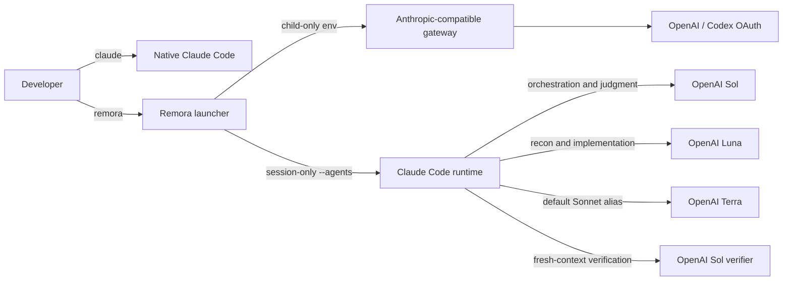

# Remora

> Run Claude Code with a cost-aware GPT-5.6 agent fleet.

**Remora** attaches OpenAI GPT-5.6 models to Claude Code for one session. Sol plans, orchestrates, and verifies critical work; Luna handles exploration and implementation at lower cost; Terra provides a balanced everyday switch. Claude Code remains the interface, tool runtime, and agent orchestrator. Like the fish it is named after, Remora leaves its host unchanged when the session ends.

[繁體中文](./README.zh-TW.md)

## Contents

- [What it changes](#what-it-changes)
- [Architecture](#architecture)
- [Model map](#model-map)
- [Who it is for](#who-it-is-for)
- [Trust and security](#trust-and-security)
- [Requirements](#requirements)
- [Install](#install)
- [Configure](#configure)
- [Use](#use)
- [Verify isolation](#verify-isolation)
- [Operational notes](#operational-notes)
- [Operational security](#operational-security)
- [Uninstall](#uninstall)
- [Prior art](#prior-art)

## What it changes

Remora launches a child `claude` process with a session-only `--agents` JSON document and a child-only gateway environment. Claude Code officially documents `--agents` as a current-session source that outranks project and user agent files without persisting them.

| Surface | Native `claude` | `remora` session |
|---|---|---|
| Command | Unchanged | Separate executable |
| Anthropic login | Unchanged | Replaced only in the child environment |
| `~/.claude/settings.json` | Never written | Still readable by Claude Code |
| `~/.claude/agents/` | Never written | Session agents take precedence by name |
| Project `.claude/` | Never written | Continues to load normally |
| Shell aliases/functions | Never written | None required |

> **Core guarantee:** quitting Remora ends every override. Running `claude` afterward uses the same command, credentials, settings, and agents it used before installation.

## Architecture



The launcher is intentionally not a proxy and stores no OAuth credentials. Bring an Anthropic-compatible gateway such as [CLIProxyAPI](https://github.com/router-for-me/CLIProxyAPI), then point Remora at it. See [the architecture rationale](./docs/architecture.md) and [gateway runbook](./docs/cliproxyapi.md).

## Model map

The defaults mirror the working GPT-5.6 split that motivated this repository. Every name is configurable because gateways expose different model catalogs.

Claude Code's built-in aliases remain useful escape hatches: Opus defaults to Sol, Sonnet to Terra, and Haiku to Luna.

| Role | Default model | Effort | Responsibility |
|---|---|---:|---|
| Main session | `gpt-5.6-sol` | User-selected | Plan, decide, integrate |
| `Explore` | `gpt-5.6-luna` | low | Broad read-only search |
| `scout` | `gpt-5.6-luna` | low | Focused reconnaissance |
| `mech-executor` | `gpt-5.6-luna` | medium | Fully specified mechanical work |
| `executor` | `gpt-5.6-luna` | max | Cost-efficient implementation with deeper reasoning |
| `verifier` | `gpt-5.6-sol` | high | Independent adversarial verification |
| `security-executor` | `gpt-5.6-sol` | max | Security-sensitive work |

## Who it is for

Remora is for developers who prefer Claude Code's interaction model but want their coding work executed by a tiered GPT-5.6 fleet. It is especially useful when a single frontier model for every subtask is unnecessarily expensive.

| Good fit | Need Remora addresses |
|---|---|
| Claude Code power users | Keep Claude Code tools, permissions, hooks, project instructions, and session continuation while using OpenAI models |
| Codex/OpenAI subscribers | Use an existing OpenAI OAuth-backed gateway from the Claude Code interface |
| Multi-agent developers | Assign planning, reconnaissance, implementation, verification, and security work to distinct model/effort tiers |
| Cost-conscious teams and solo builders | Reserve Sol for judgment and verification while Luna max performs routine implementation |
| Home-lab operators | Connect to an existing self-hosted CLIProxyAPI deployment without embedding gateway management into the launcher |
| Anthropic and OpenAI users | Switch with `claude` and `remora` instead of replacing native Claude configuration |

Remora is not a hosted gateway, an OAuth account manager, an official OpenAI or Anthropic integration, or a zero-trust sandbox. It is a poor fit where organizational policy prohibits model gateways or where only vendor-supported routing is acceptable.

## Trust and security

> Installation is approval-gated, release artifacts are verifiable, and runtime overrides are confined to the Remora child process.

| Guarantee | Enforcement |
|---|---|
| Read before write | The one-prompt runbook requires a read-only preflight and complete change plan before approval |
| Immutable source | Recommended prompts reference a release tag; every fetched installer file must use the same tag |
| Verifiable release | Bootstrap requires SHA-256 and GitHub artifact attestation; checksum-only mode needs an explicit downgrade |
| No blind overwrite | Installer refuses unrelated executables and preserves existing user configuration |
| Native Claude isolation | Installer and launcher never write `~/.claude`, replace `claude`, or read the Anthropic login |
| Secret minimization | Gateway tokens come from an environment variable or direct credential command and are never printed |
| Reversible scope | Only three Remora-owned locations are installed; uninstall does not touch native Claude |

The gateway and upstream model still receive prompts and any source Claude Code sends them. Review the full [security policy](./SECURITY.md) and [gateway trust boundary](./docs/cliproxyapi.md) before using Remora on sensitive repositories.

## Requirements

| Dependency | Requirement |
|---|---|
| Claude Code | A version supporting dynamic `--agents` definitions |
| Python | 3.11 or newer; standard library only |
| Gateway | Anthropic Messages-compatible base URL with the configured model names |
| Platform | macOS or Linux; WSL should work but is not yet tested |
| Authentication | Gateway token in an environment variable or OS credential-store command |

## Install

### Approval-gated one-prompt install

Give Claude Code this prompt. The immutable tag is intentional:

```text
Read and follow this installation runbook:
https://raw.githubusercontent.com/Nanako0129/remora-cc/v0.1.0/install/AGENT-INSTALL.md

Perform only the read-only preflight first. Show every proposed filesystem
change, trust boundary, download source, and verification step. Do not write
anything until I explicitly approve.
```

The runbook will not ask for a bearer token or OAuth file. It stops at an approval gate, downloads the matching release, verifies its SHA-256 and GitHub attestation, installs atomically, and checks that `~/.claude` did not change.

### Manual source install

```bash
git clone --branch v0.1.0 --depth 1 https://github.com/Nanako0129/remora-cc.git
cd remora-cc
./install.sh
```

The installer copies Remora under the XDG data directory, creates a configuration only when none exists, and links one new executable:

```text
~/.local/bin/remora
~/.local/share/remora-cc/
~/.config/remora-cc/config.toml
```

It does not add the bin directory to `PATH`. If needed, add this to your shell profile yourself:

```bash
export PATH="$HOME/.local/bin:$PATH"
```

## Configure

Edit the generated configuration:

```bash
${EDITOR:-vi} ~/.config/remora-cc/config.toml
```

For a quick local test, export the gateway token in the current terminal:

```bash
export REMORA_AUTH_TOKEN='replace-me'
remora doctor --online
```

For daily macOS use, retrieve the token from Keychain instead of storing it in TOML:

```toml
[proxy]
base_url = "http://127.0.0.1:8317"
auth_token_env = "REMORA_AUTH_TOKEN"
auth_token_command = ["security", "find-generic-password", "-a", "YOUR_MACOS_USER", "-s", "cliproxyapi", "-w"]
```

The environment variable wins when present; otherwise Remora executes the array directly without a shell and reads the token from stdout.

## Use

Run Remora anywhere you would run Claude Code:

```bash
cd ~/src/my-project
remora
remora --continue
remora -p 'summarize this repository'
```

All unrecognized arguments pass through to `claude`. Explicit Claude flags win: supplying your own `--model` or `--agents` prevents Remora from injecting that specific default.

Useful diagnostics:

| Command | Result |
|---|---|
| `remora doctor` | Validate binary, configuration, agent rendering, and secret retrieval |
| `remora doctor --online` | Also call the gateway model endpoint |
| `remora agents` | Show effective role/model/effort assignments |
| `remora render-agents` | Print the exact JSON supplied through `--agents` |
| `remora dry-run --continue` | Print a token-free launch preview |

## Verify isolation

Before and after installation, these checks should produce identical hashes because Remora never writes them:

```bash
find ~/.claude -type f -maxdepth 3 -print0 \
  | sort -z \
  | xargs -0 shasum -a 256 > /tmp/claude-files.sha256

remora dry-run
claude --version
```

The strongest behavioral check is simply to run both commands. `remora agents` should show the OpenAI map; plain `claude` should retain its original model and authentication.

## Operational notes

| Symptom | Meaning | Action |
|---|---|---|
| Agent inherits the main model | A global `CLAUDE_CODE_SUBAGENT_MODEL` overrode the agent map | Remora clears it in the child by default; confirm with `remora doctor` |
| `All credentials ... are cooling down` | The gateway locally suspended the only credential/model after an upstream 429 | Wait for reset, add failover credentials, lower concurrency, or restart only as a last-resort state reset |
| Models work but names differ | The gateway exposes aliases different from this example | Update `[models]` and `[agent_models]` |
| Native Claude also uses the gateway | Gateway variables were exported globally in the shell | Remove global `ANTHROPIC_*` exports; let Remora set them for its child |
| A role is missing | An explicit `--agents` flag replaced Remora's dynamic map | Remove that flag or merge the role into your supplied JSON |

> ⚠️ **Do not disable gateway cooldown globally as the first fix.** A real upstream rate limit can become a retry storm. The safer order is lower concurrency, bounded retry, multiple credentials, and correct classification of transient versus quota 429 responses.

## Operational security

Remora never prints the gateway token, includes no telemetry, and invokes credential-store commands as an argument array without shell expansion. The proxy still receives source code and prompts, and the selected OpenAI account still processes them. Read [SECURITY.md](./SECURITY.md) before using a remote gateway.

## Uninstall

```bash
./uninstall.sh
```

The default keeps the configuration for reinstalling. Remove it too with:

```bash
./uninstall.sh --purge
```

Neither path touches `~/.claude`.

## Prior art

Remora packages a narrow technique rather than inventing multi-agent routing. [pilotfish](https://github.com/Nanako0129/pilotfish) established the role-based orchestration pattern; Anthropic documents dynamic session agents and custom LLM gateways; [CLIProxyAPI](https://github.com/router-for-me/CLIProxyAPI) supplies the protocol bridge. [Overdeck](https://github.com/eltmon/overdeck) is a much larger orchestration platform that can manage its own CLIProxyAPI sidecar. Remora's contribution is the opposite scope choice: one auditable launcher for an existing gateway, with no mutation of native Claude state.

## License

[MIT](./LICENSE)
