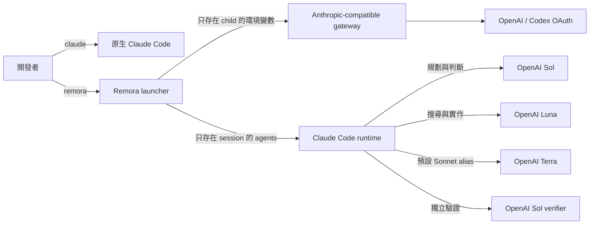

# Remora

> 在 Claude Code 裡運行一支兼顧成本與能力的 GPT-5.6 Agent 團隊。

**Remora** 只在目前 session 把 OpenAI GPT-5.6 模型接入 Claude Code：Sol 負責規劃、協調與關鍵驗證，Luna 以較低成本處理搜尋與實作，Terra 提供平衡的日常切換。Claude Code 保留原本的介面、工具與 Agent runtime；session 結束後，Remora 不會在宿主留下模型改造。

[English](./README.md)

## 目錄

- [不會修改什麼](#不會修改什麼)
- [架構](#架構)
- [模型分配](#模型分配)
- [適合誰使用](#適合誰使用)
- [信任與安全](#信任與安全)
- [需求](#需求)
- [安裝](#安裝)
- [設定](#設定)
- [使用](#使用)
- [驗證原生 Claude 未受影響](#驗證原生-claude-未受影響)
- [常見狀況](#常見狀況)
- [執行期安全](#執行期安全)
- [移除](#移除)

## 不會修改什麼

Remora 只替一個 child `claude` process 注入 `--agents` JSON 與 gateway 環境變數。Claude Code 官方把 `--agents` 定義為只存在於當前 session 的 agent source；它可以暫時覆蓋同名的 project/user agent，但不會寫入磁碟。

| 項目 | 原生 `claude` | `remora` session |
|---|---|---|
| 指令 | 完全不變 | 新增另一個 executable |
| Anthropic 登入 | 完全不變 | 只在 child environment 改走 gateway |
| `~/.claude/settings.json` | 永不寫入 | Claude Code 仍可正常讀取 |
| `~/.claude/agents/` | 永不寫入 | 同名角色只在該 session 優先 |
| Project `.claude/` | 永不寫入 | 照常載入 |
| Shell alias/function | 永不寫入 | 不需要 alias |

> **核心保證：** 關閉 Remora session 後，所有 override 隨 child process 消失。之後執行 `claude`，仍使用安裝前相同的登入、設定與 agents。

## 架構



Remora 本身不是 proxy，也不保存 OAuth credential。你需要準備 Anthropic Messages-compatible gateway，例如 [CLIProxyAPI](https://github.com/router-for-me/CLIProxyAPI)。完整原理在 [架構文件](./docs/architecture.md)，gateway 部署與連線注意事項在 [CLIProxyAPI runbook](./docs/cliproxyapi.md)。

## 模型分配

Claude Code 內建 alias 也保留作為方便的切換入口：Opus 預設指向 Sol、Sonnet 指向 Terra、Haiku 指向 Luna。

| 角色 | 預設模型 | Effort | 用途 |
|---|---|---:|---|
| Main session | `gpt-5.6-sol` | 使用者選擇 | 規劃、決策、整合 |
| `Explore` | `gpt-5.6-luna` | low | 廣域唯讀搜尋 |
| `scout` | `gpt-5.6-luna` | low | 聚焦偵察 |
| `mech-executor` | `gpt-5.6-luna` | medium | 規格完整的機械工作 |
| `executor` | `gpt-5.6-luna` | max | 兼顧成本、以深度推理完成實作 |
| `verifier` | `gpt-5.6-sol` | high | Fresh-context 對抗驗證 |
| `security-executor` | `gpt-5.6-sol` | max | 安全敏感工作 |

所有名稱都能在 TOML 修改，因為不同 gateway 暴露的 model catalog 不一定相同。

## 適合誰使用

Remora 是給喜歡 Claude Code 操作方式、但希望由分層 GPT-5.6 團隊完成 coding 工作的人。當每一個 subtask 都使用最高成本模型並不划算時，它的角色分流特別有價值。

| 適合的使用者 | Remora 解決的需求 |
|---|---|
| Claude Code 重度使用者 | 保留 tools、permissions、hooks、project instructions 與 session continuation，同時使用 OpenAI 模型 |
| Codex／OpenAI 訂閱使用者 | 從 Claude Code 介面使用既有 OpenAI OAuth gateway |
| 多 Agent 開發者 | 讓規劃、偵察、實作、驗證與安全工作使用不同 model／effort tier |
| 在意成本的團隊與個人開發者 | Sol 保留給判斷與驗證，普通實作交由 Luna max |
| Home lab 維運者 | 連接既有 CLIProxyAPI，不把 gateway 管理塞進 launcher |
| 同時使用 Anthropic 與 OpenAI 的人 | 用 `claude` 與 `remora` 切換，不取代原生 Claude 設定 |

Remora 不是託管 gateway、OAuth 帳號管理器、OpenAI／Anthropic 官方整合或 zero-trust sandbox。若組織政策禁止模型 gateway，或環境只能接受原廠支援的 routing，Remora 並不適合。

## 信任與安全

> 安裝前必須明確批准、release artifact 可驗證，而且 runtime override 只存在於 Remora child process。

| 保證 | 實際約束 |
|---|---|
| 先讀後寫 | One-prompt runbook 必須先做唯讀 preflight，完整列出變更後才等待批准 |
| 固定來源 | 推薦 prompt 使用 release tag，所有 installer 檔案必須來自相同 tag |
| 可驗證 release | Bootstrap 強制驗證 SHA-256 與 GitHub attestation；降級為 checksum-only 必須明確指定 |
| 不盲目覆蓋 | Installer 拒絕取代不屬於 Remora 的 executable，並保留既有使用者設定 |
| 原生 Claude 隔離 | 不寫入 `~/.claude`、不替換 `claude`、不讀 Anthropic login |
| Secret 最小化 | Token 只從環境變數或直接 credential command 取得，而且不印出 |
| 可逆範圍 | 只安裝三個 Remora-owned 位置，移除時不碰原生 Claude |

Gateway 與上游模型仍會收到 Claude Code 傳送的 prompt 與原始碼。將 Remora 用在敏感 repository 前，請閱讀完整 [安全政策](./SECURITY.md) 與 [gateway trust boundary](./docs/cliproxyapi.md)。

## 需求

| 相依項目 | 需求 |
|---|---|
| Claude Code | 支援動態 `--agents` JSON 的版本 |
| Python | 3.11 以上；只用 standard library |
| Gateway | Anthropic Messages-compatible endpoint，並提供設定內的模型名稱 |
| 平台 | macOS 或 Linux；WSL 理論上可用但尚未驗證 |
| 認證 | 環境變數或 OS credential store command 提供 gateway token |

## 安裝

### 需要批准的 one-prompt install

把以下 prompt 交給 Claude Code；固定 tag 是安全設計的一部分：

```text
請閱讀並遵循這份安裝 runbook：
https://raw.githubusercontent.com/Nanako0129/remora-cc/v0.1.0/install/AGENT-INSTALL.md

先只執行唯讀 preflight。列出所有預計的檔案變更、trust boundary、
下載來源與驗證步驟。在我明確批准以前，不要寫入任何內容。
```

Runbook 不會要求 bearer token 或 OAuth 檔案。它會停在 approval gate，下載同版本 release，驗證 SHA-256 與 GitHub attestation，原子化安裝，最後確認 `~/.claude` 沒有改變。

### 手動 source install

```bash
git clone --branch v0.1.0 --depth 1 https://github.com/Nanako0129/remora-cc.git
cd remora-cc
./install.sh
```

安裝後只有三個 Remora 路徑：

```text
~/.local/bin/remora
~/.local/share/remora-cc/
~/.config/remora-cc/config.toml
```

若 `~/.local/bin` 尚未在 `PATH`，請自行加入 shell profile：

```bash
export PATH="$HOME/.local/bin:$PATH"
```

## 設定

```bash
${EDITOR:-vi} ~/.config/remora-cc/config.toml
```

臨時測試可從目前 terminal 提供 token：

```bash
export REMORA_AUTH_TOKEN='replace-me'
remora doctor --online
```

macOS 日常使用建議改從 Keychain 讀取，不要把 token 寫進 TOML：

```toml
[proxy]
base_url = "http://127.0.0.1:8317"
auth_token_env = "REMORA_AUTH_TOKEN"
auth_token_command = ["security", "find-generic-password", "-a", "YOUR_MACOS_USER", "-s", "cliproxyapi", "-w"]
```

環境變數存在時優先；否則 Remora 不經 shell，直接執行陣列內的 command，將 stdout 當成 child process 的 `ANTHROPIC_AUTH_TOKEN`。

## 使用

```bash
cd ~/src/my-project
remora
remora --continue
remora -p 'summarize this repository'
```

Remora 不認識的參數會原樣交給 `claude`。若明確傳入 `--model` 或 `--agents`，該項會以你的參數為準，不再注入 Remora default。

| 指令 | 用途 |
|---|---|
| `remora doctor` | 驗證 binary、TOML、agent rendering 與 secret retrieval |
| `remora doctor --online` | 額外呼叫 gateway 的 model endpoint |
| `remora agents` | 顯示實際角色、模型與 effort |
| `remora render-agents` | 印出送入 `--agents` 的完整 JSON |
| `remora dry-run --continue` | 顯示不含 token 的 launch preview |

## 驗證原生 Claude 未受影響

Remora 不會寫入 `~/.claude`。最直接的行為驗證是分別執行：

```bash
remora agents
claude --version
```

第一個指令應顯示 OpenAI 分流；第二個仍是原生 Claude Code。若要做檔案級驗證，可在安裝前後對 `~/.claude` 建立 SHA-256 manifest 比較。

## 常見狀況

| 現象 | 原因 | 處理方式 |
|---|---|---|
| Subagent 繼承 main model | 全域 `CLAUDE_CODE_SUBAGENT_MODEL` 覆蓋角色模型 | Remora 預設只在 child 清除它；用 `remora doctor` 確認 |
| `All credentials ... are cooling down` | Gateway 在上游 429 後暫停唯一 credential/model | 等 reset、降低並行、增加 credential；重啟只應是最後的 state reset |
| 模型不存在 | Gateway alias 與範例不同 | 修改 `[models]` 與 `[agent_models]` |
| 原生 Claude 也走 gateway | 你在 shell 全域 export 了 `ANTHROPIC_*` | 移除全域 export，交給 Remora child 注入 |
| 找不到某個角色 | 你另外傳了 `--agents`，取代 Remora map | 移除該參數，或自行合併 JSON |
| TokenBar Overview 沒顯示 Luna | 低占比模型可能未出現在 tooltip | 到 `Claude → Models` 檢查；subagent 仍歸 `client=claude, provider=openai` |

> ⚠️ **不要第一時間全域關閉 gateway cooldown。** 真實上游限流可能變成 retry storm。較安全順序是降低 concurrency、使用 bounded retry、增加 credential，再修正 transient 429 與 quota 429 的分類。

## 執行期安全

Remora 不印 token、沒有 telemetry，credential command 也不經 shell。但 proxy 仍會收到 prompt 與程式碼，OpenAI 帳號也會處理資料。使用遠端 gateway 前請閱讀 [SECURITY.md](./SECURITY.md)。

## 移除

```bash
./uninstall.sh
```

預設保留 TOML，方便日後重裝。連設定一起刪除：

```bash
./uninstall.sh --purge
```

兩種方式都不會碰 `~/.claude`。

## License

[MIT](./LICENSE)
