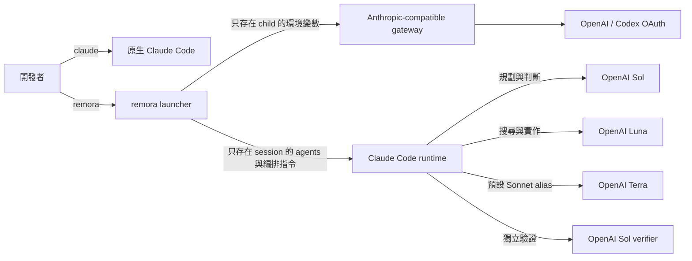

# remora

> 在 Claude Code 裡運行一支兼顧成本與能力的 GPT-5.6 Agent 團隊。

**remora** 只在目前 session 把 OpenAI GPT-5.6 模型接入 Claude Code：Sol 負責規劃、協調與關鍵驗證，Luna 以較低成本處理搜尋與實作，Terra 提供平衡的日常切換。Claude Code 保留原本的介面、工具與 Agent runtime；session 結束後，remora 不會在宿主留下模型改造。

[English](./README.md)

## 目錄

- [不會修改什麼](#不會修改什麼)
- [架構](#架構)
- [模型分配](#模型分配)
- [適合誰使用](#適合誰使用)
- [信任與安全](#信任與安全)
- [需求](#需求)
- [安裝](#安裝)
- [設定](#設定)
- [使用](#使用)
- [驗證原生 Claude 未受影響](#驗證原生-claude-未受影響)
- [常見問答](#常見問答)
- [常見狀況](#常見狀況)
- [執行期安全](#執行期安全)
- [移除](#移除)
- [Prior art](#prior-art)
- [License](#license)

## 不會修改什麼

remora 只替一個 child `claude` process 注入 `--agents` JSON、session-only 編排補充指令與 gateway 環境變數。Claude Code 官方把 `--agents` 定義為只存在於當前 session 的 agent source；它可以暫時覆蓋同名的 project/user agent，但不會寫入磁碟。編排補充指令採用 phase-aware dispatch brake：Discovery 先穩定問題、證據格式與停止條件，不假裝最終實作已知；main session 再綜整一份 Plan、在需要時等待明確批准、只派出契約穩定的執行工作，最後以 fresh verification 關閉非平凡工作。通過各 phase gate 後再比較整體淨效益；即使直接做稍快，只要範圍明確的 Luna worker 能實質節省 Sol 額度，仍可委派。

[Baton](https://github.com/cablate/baton) 這類 delegation planner 可以合成在角色層上方：Baton 規劃問題、拓撲、worker 數量、ownership、順序、預算與停止條件；remora 仍唯一掌管命名角色、模型路由、leaf 邊界、批准與 verifier 詞彙。完整雙 turn 相容性 Gate、被拒絕的候選版本與原始 prompts 已[公開並可重現](./benchmarks/baton-compatibility/README.zh-TW.md)。

| 項目 | 原生 `claude` | `remora` session |
|---|---|---|
| 指令 | 完全不變 | 新增另一個 executable |
| Anthropic 登入 | 完全不變 | 只在 child environment 改走 gateway |
| `~/.claude/settings.json` | 永不寫入 | Claude Code 仍可正常讀取 |
| Additional settings | 無 | 透過 `--settings` 傳入只存在 child 的 model allowlist |
| `~/.claude/agents/` | 永不寫入 | 同名角色只在該 session 優先 |
| Project `.claude/` | 永不寫入 | 照常載入 |
| Shell alias/function | 永不寫入 | 不需要 alias |
| Runtime marker | 不存在 | 只在 child 設定 `REMORA_ACTIVE=1` |

> **核心保證：** 關閉 remora session 後，所有 override 隨 child process 消失。之後執行 `claude`，仍使用安裝前相同的登入、設定與 agents。

## 架構



remora 本身不是 proxy，也不保存 OAuth credential。你需要準備 Anthropic Messages-compatible gateway，例如 [CLIProxyAPI](https://github.com/router-for-me/CLIProxyAPI)。完整原理在 [架構文件](./docs/architecture.md)，從零部署與 GUI OAuth 操作在 [CLIProxyAPI 繁中指引](./docs/cliproxyapi.zh-TW.md)。

## 模型分配

Claude Code 內建 alias 也保留作為方便的切換入口：Opus 預設指向 Sol、Sonnet 指向 Terra、Haiku 指向 Luna。

| 角色 | 預設模型 | Effort | 用途 |
|---|---|---:|---|
| Main session | `gpt-5.6-sol` | 使用者選擇 | 規劃、決策、整合 |
| `Explore` | `gpt-5.6-luna` | low | 廣域唯讀搜尋 |
| `scout` | `gpt-5.6-luna` | low | 聚焦偵察 |
| `mech-executor` | `gpt-5.6-luna` | medium | 規格完整的機械工作 |
| `executor` | `gpt-5.6-luna` | max | 兼顧成本、以深度推理完成實作 |
| `verifier` | `gpt-5.6-sol` | high | Fresh-context 對抗驗證 |
| `security-executor` | `gpt-5.6-sol` | max | 安全敏感工作 |

所有名稱都能在 TOML 修改，因為不同 gateway 暴露的 model catalog 不一定相同。

Claude Code 會用 `availableModels` 驗證 subagent model。若使用者平常的設定只列 Claude aliases，`gpt-5.6-luna` 這類 gateway id 原本會被拒絕，並且靜默繼承 Sol main model。remora 現在會傳入只存在 child 的 additional settings，allowlist 所有已設定的 gateway model；不寫入或取代使用者設定，組織 managed policy 也仍保有原本的較高優先權。

對於已命名的 agent，角色定義是唯一的 model 來源。remora 的 orchestration policy 因此禁止在呼叫 `Explore`、`scout`、`mech-executor`、`executor`、`verifier`、`security-executor` 或任何其他已存在的命名角色時傳入 `model`；Claude Code 會優先使用 invocation-level model，進而繞過角色表。只有沒有角色定義的真正 ad-hoc agent 才會在呼叫時明確指定 model。

### Context 安全界線

OpenAI 公開 GPT-5.6 API 標示 1.05M context window，CLIProxyAPI 的 Codex OAuth catalog 目前則替 Sol、Terra、Luna 回報 372K。但 Codex runtime catalog 是另一個更晚套用的權威來源：2026-07-13 的 hot update 已把三個模型改成 272K，bundled Codex catalog 與 CLIProxyAPI metadata 仍維持 372K。remora 因此不再把公開 API 或 gateway 數字直接當成 client ceiling。

Claude Code 會把不認識的 custom model id 視為 200K。remora 因此預設使用 `stock` 模式：client window 如實維持 200K，compact 完全交給 Claude 原生 pipeline。原生 Claude 會另外保留 output token 並預先產生摘要，所以可能在顯示上限前 compact；remora 不會替這個模式虛構一個精確 trigger。

想使用 Codex runtime 對齊視窗的人，可以自行安裝 [Calico Claude](https://github.com/Nanako0129/calico-claude)，再明確選擇 `calico` 模式。remora 會同時讀 gateway catalog 與新鮮的 Codex `models_cache.json`，逐模型採用較小值；Codex cache 不存在、過期或不完整時，則採用可設定的 272K 安全 fallback。現在的 272K runtime window 會顯示為 258.4K usable context，並在 244.8K compact，對齊 Codex 的 95% 顯示與 90% compact 預設。若之後新鮮的 runtime catalog 恢復 372K，remora 也會恢復 372K，fallback 並非永久鎖定。Map 格式錯誤、model id 不吻合或 binary 缺少 patch 時都會 fail closed。

| 模式 | Claude binary | 顯示視窗 | Compact 時機 | 預設 |
|---|---|---:|---:|---|
| `stock` | 官方 native Claude Code | 200K | Claude 原生管理 | 是 |
| `calico` | 通過驗證的 Calico release | Gateway／Codex 較小值的 95% | Gateway／Codex 較小值的 90% | 明確 opt-in |

```toml
[context]
mode = "stock"
stock_window = 200000
discovery = true
fallback_window = 372000
codex_fallback_window = 272000
codex_cache_ttl_seconds = 300
effective_window_percent = 95
auto_compact_percent = 90
```

安裝含有 `custom-context-window` 的 Calico release 後，只要改成 `mode = "calico"`，並在開始工作前執行 `remora doctor --online`。

## 適合誰使用

remora 是給喜歡 Claude Code 操作方式、但希望由分層 GPT-5.6 團隊完成 coding 工作的人。當每一個 subtask 都使用最高成本模型並不划算時，它的角色分流特別有價值。

| 適合的使用者 | remora 解決的需求 |
|---|---|
| Claude Code 重度使用者 | 保留 tools、permissions、hooks、project instructions 與 session continuation，同時使用 OpenAI 模型 |
| Codex／OpenAI 訂閱使用者 | 從 Claude Code 介面使用既有 OpenAI OAuth gateway |
| 多 Agent 開發者 | 讓規劃、偵察、實作、驗證與安全工作使用不同 model／effort tier |
| 在意成本的團隊與個人開發者 | Sol 保留給判斷與驗證，普通實作交由 Luna max |
| Home lab 維運者 | 連接既有 CLIProxyAPI，不把 gateway 管理塞進 launcher |
| 同時使用 Anthropic 與 OpenAI 的人 | 用 `claude` 與 `remora` 切換，不取代原生 Claude 設定 |

remora 不是託管 gateway、OAuth 帳號管理器、OpenAI／Anthropic 官方整合或 zero-trust sandbox。若組織政策禁止模型 gateway，或環境只能接受原廠支援的 routing，remora 並不適合。

## 信任與安全

> 安裝前必須明確批准、release artifact 可驗證，而且 runtime override 只存在於 remora child process。

| 保證 | 實際約束 |
|---|---|
| 先讀後寫 | One-prompt runbook 必須先做唯讀 preflight，完整列出變更後才等待批准 |
| 固定來源 | 推薦 prompt 使用 release tag，所有 installer 檔案必須來自相同 tag |
| 可驗證 release | Bootstrap 強制驗證 SHA-256 與 GitHub attestation；降級為 checksum-only 必須明確指定 |
| 不盲目覆蓋 | Installer 拒絕取代不屬於 remora 的 executable，並保留既有使用者設定 |
| 原生 Claude 隔離 | 不寫入 `~/.claude`、不替換 `claude`、不讀 Anthropic login |
| Secret 最小化 | Token 只從環境變數或直接 credential command 取得，而且不印出 |
| 可逆範圍 | 安裝內容與 runtime state 都留在 remora-owned XDG 路徑；移除時刪除程式與 runtime state、預設保留設定，且不碰原生 Claude |

Gateway 與上游模型仍會收到 Claude Code 傳送的 prompt 與原始碼。將 remora 用在敏感 repository 前，請閱讀完整 [安全政策](./SECURITY.md) 與 [gateway trust boundary](./docs/cliproxyapi.md)。

## 需求

| 相依項目 | 需求 |
|---|---|
| Claude Code | 支援動態 `--agents` JSON 的版本 |
| Python | 3.11 以上；只用 standard library |
| Gateway | Anthropic Messages-compatible endpoint，並提供設定內的模型名稱 |
| 平台 | macOS 或 Linux；WSL 理論上可用但尚未驗證 |
| 認證 | 環境變數或 OS credential store command 提供 gateway token |

## 安裝

### 需要批准的 one-prompt install

把以下 prompt 交給 Claude Code；固定 tag 是安全設計的一部分：

```text
請閱讀並遵循這份安裝 runbook：
https://raw.githubusercontent.com/Nanako0129/remora-cc/v0.1.9/install/AGENT-INSTALL.md

先只執行唯讀 preflight。列出所有預計的檔案變更、trust boundary、
下載來源與驗證步驟。在我明確批准以前，不要寫入任何內容。
```

Runbook 不會要求 bearer token 或 OAuth 檔案。它會停在 approval gate，下載同版本 release，驗證 SHA-256 與 GitHub attestation，原子化安裝，最後確認 `~/.claude` 沒有改變。

### 手動 source install

```bash
git clone --branch v0.1.9 --depth 1 https://github.com/Nanako0129/remora-cc.git
cd remora-cc
./install.sh
```

安裝後只有三個 remora 路徑：

```text
~/.local/bin/remora
~/.local/share/remora-cc/
~/.config/remora-cc/config.toml
```

第一次啟動時，remora 可能會在 `${XDG_STATE_HOME:-$HOME/.local/state}/remora-cc/` 建立 runtime integration state。這些資料只屬於 remora，不會放進 `~/.claude`，移除 remora 時也會一併刪除。

若 `~/.local/bin` 尚未在 `PATH`，請自行加入 shell profile：

```bash
export PATH="$HOME/.local/bin:$PATH"
```

## 設定

還沒有 gateway 時，先依照 [CLIProxyAPI Docker Compose 快速部署](./docs/cliproxyapi.zh-TW.md#docker-compose-快速部署)完成服務與 Codex OAuth GUI 操作，再帶著 proxy API key 回到這裡。

```bash
${EDITOR:-vi} ~/.config/remora-cc/config.toml
```

臨時測試可從目前 terminal 提供 token：

```bash
export REMORA_AUTH_TOKEN='replace-me'
remora doctor --online
```

macOS 日常使用建議改從 Keychain 讀取，不要把 token 寫進 TOML：

```toml
[proxy]
base_url = "http://127.0.0.1:8317"
auth_token_env = "REMORA_AUTH_TOKEN"
auth_token_command = ["security", "find-generic-password", "-a", "YOUR_MACOS_USER", "-s", "cliproxyapi", "-w"]
```

環境變數存在時優先；否則 remora 不經 shell，直接執行陣列內的 command，將 stdout 當成 child process 的 `ANTHROPIC_AUTH_TOKEN`。

## 使用

```bash
cd ~/src/my-project
remora
remora --continue
remora -p 'summarize this repository'
```

remora 不認識的參數會原樣交給 `claude`。若明確傳入 `--model` 或 `--agents`，該項會以你的參數為準，不再注入 remora default。

| 指令 | 用途 |
|---|---|
| `remora doctor` | 驗證 binary、TOML、agent rendering 與 secret retrieval |
| `remora doctor --online` | 額外驗證 gateway model、context ceiling 與可選的 active-turn protocol |
| `remora agents` | 顯示實際角色、模型與 effort |
| `remora render-agents` | 印出送入 `--agents` 的完整 JSON |
| `remora dry-run --continue` | 顯示不含 token 的 launch preview |

## 驗證原生 Claude 未受影響

remora 不會寫入 `~/.claude`。最直接的行為驗證是分別執行：

```bash
remora agents
claude --version
```

第一個指令應顯示 OpenAI 分流；第二個仍是原生 Claude Code。若要做檔案級驗證，可在安裝前後對 `~/.claude` 建立 SHA-256 manifest 比較。

## 常見問答

| 問題 | 回答 |
|---|---|
| remora 只是 model alias 嗎？ | 不是。它會在單一 session 注入 agent roster、model allowlist、角色 effort 與 gateway environment，因此 main、executor、scout、verifier 可以使用不同 GPT-5.6 tier。 |
| remora 會取代原生 Claude Code 嗎？ | 不會。`remora` 只啟動 child process；直接執行 `claude` 仍使用原本的設定與登入。Calico 也是另外明確選用的元件。 |
| 一定要裝 Calico 嗎？ | 不必。`stock` 模式可搭配官方 Claude binary，依原生 custom model 的 200K 行為運作。只有 Codex-runtime-sized context 與可選的 active-turn identity adapter 需要 Calico。 |
| CLIProxyAPI 可以放在另一台電腦嗎？ | 可以。`proxy.base_url` 使用可信任 LAN／VPN 位址；management UI 與 OAuth callback 應維持 loopback，再透過 SSH tunnel 存取。 |
| 為什麼 `claude --version` 顯示 patched，remora 卻說缺少 Calico adapter？ | 舊 Calico build 可能仍有品牌 patch，但不含較新的 context／active-turn modules；Claude updater 也可能替換 patched version。`remora doctor --online` 會檢查真正的 capability marker，不只相信名稱。 |
| 如何讓原生 Claude 更新與 remora 的 Calico binary 互不影響？ | 把 patched binary 另存為 `~/.local/bin/calico-claude`，將 `[runtime].claude_binary` 設成其絕對路徑，並讓 `~/.local/bin/claude` 繼續交給官方 updater。 |
| Active-turn v1 能保證 quota 用完後無限執行嗎？ | 不能。它只保存可觀察到的 native Codex turn contract；OpenAI 仍會套用 fair-use 並可終止 turn。v1 也只在單一 local Codex credential 且關閉 cooling 時廣告 ready。 |
| `/resume` 會套用剛修改的 model map 嗎？ | 不一定。Claude 可能從舊 transcript 恢復當時的 session-scoped agent definitions。修改 routing 後應開新 remora session，或 handoff 到新 session。 |
| remora 能與 Baton 這類 delegation-planning skill 一起使用嗎？ | 可以，前提是責任合成而非互相覆寫：Baton 決定 Discovery 與 Execution 拓撲；remora 提供命名角色、模型路由、leaf 邊界、批准與兩種 verifier mode。[v0.1.8 相容性 Gate](./benchmarks/baton-compatibility/README.zh-TW.md) 已完成 Discovery → main-session Plan → 明確批准 → Execution → fresh verification，探索實際使用 Luna，驗證使用 Sol。remora 不會暗中停用任意 skill；明確的 `--append-system-prompt*` 仍會在該 session 取代預設 policy。 |
| remora session 能使用 claude.ai remote control 或 connectors 嗎？ | Gateway mode 不會保留原生 claude.ai authenticated transport，因此相關功能可能不可用；需要時請直接執行 `claude`。 |

## 常見狀況

| 現象 | 原因 | 處理方式 |
|---|---|---|
| Subagent 繼承 main model | 全域 `CLAUDE_CODE_SUBAGENT_MODEL` 覆蓋角色模型 | remora 預設只在 child 清除它；用 `remora doctor` 確認 |
| 所有角色都變成 main model | Claude Code 的 `availableModels` 排除了 gateway ids | 升級 remora 0.1.4；`doctor` 必須在 routing allowlist 顯示所有設定模型 |
| `/resume` 後 Agent 還在用舊模型 | 舊 transcript 恢復了當時 session-scoped agent definitions | 改完 routing 後開全新 remora session，或 handoff 到新 session |
| `All credentials ... are cooling down` | Gateway 在上游 429 後暫停唯一 credential/model | 等 reset、降低並行、增加 credential；重啟只應是最後的 state reset |
| `Codex active-turn bridge: DEGRADED` | Calico、gateway capability 或受支援的單 credential 拓撲缺少一項 | Active work 可能在 quota boundary 中斷；依實驗性 gateway 指引處理，或接受 stock 行為 |
| 模型不存在 | Gateway alias 與範例不同 | 修改 `[models]` 與 `[agent_models]` |
| `Your input exceeds the context window` | Gateway metadata、Codex runtime catalog 與 client mode 不一致 | 先執行一次 Codex 更新 `~/.codex/models_cache.json`，再跑 `remora doctor --online`；目前 Calico 應顯示 `client_window=272000` |
| 原生 Claude 也走 gateway | 你在 shell 全域 export 了 `ANTHROPIC_*` | 移除全域 export，交給 remora child 注入 |
| 找不到某個角色 | 你另外傳了 `--agents`，取代 remora map | 移除該參數，或自行合併 JSON |
| `--settings cannot be combined` | 第二份 additional settings 會取代 remora routing allowlist | 把持久設定放在 Claude 正常 settings files，session-only `--settings` 交給 remora |
| TokenBar Overview 沒顯示 Luna | 低占比模型可能未出現在 tooltip | 到 `Claude → Models` 檢查；subagent 仍歸 `client=claude, provider=openai` |
| 出現 `claude.ai connectors are disabled` | Claude Code 偵測到 remora child-only gateway auth，而不是原生 Claude login | remora session 內屬預期行為；需要 claude.ai connectors 時改跑原生 `claude` |

> ⚠️ **不要第一時間全域關閉 gateway cooldown。** 真實上游限流可能變成 retry storm。較安全順序是降低 concurrency、使用 bounded retry、增加 credential，再修正 transient 429 與 quota 429 的分類。

實驗性 active-turn bridge 是範圍很窄的例外：v1 明確要求單一 credential 且關閉 cooling，遇到 multi-account 或 Home routing 時不會廣告支援。詳見 [gateway 指引](./docs/cliproxyapi.zh-TW.md#實驗性-active-turn-bridge)。

## 執行期安全

remora 不印 token、沒有 telemetry，credential command 也不經 shell。但 proxy 仍會收到 prompt 與程式碼，OpenAI 帳號也會處理資料。使用遠端 gateway 前請閱讀 [SECURITY.md](./SECURITY.md)。

## 移除

```bash
./uninstall.sh
```

預設會刪除已安裝程式與 runtime state，但保留 TOML，方便日後重裝。連設定一起刪除：

```bash
./uninstall.sh --purge
```

兩種方式都不會碰 `~/.claude`。

## Prior art

remora 是把一項範圍明確的技術包裝成可審查的工具，並不宣稱發明了 multi-agent routing。[pilotfish](https://github.com/Nanako0129/pilotfish) 奠定依角色分工的 orchestration 模式；想研究或客製這套設計的全域 policy 版本，可以從 pilotfish 開始。[Baton](https://github.com/cablate/baton) 提供 optional plan-first 合成所使用、與平台能力無關的 delegation-planning layer。Anthropic 提供動態 session agents 與自訂 LLM gateway 的官方機制；[CLIProxyAPI](https://github.com/router-for-me/CLIProxyAPI) 則提供協定橋接。remora 的貢獻是替既有 gateway 提供一個可稽核、可安裝的 launcher，且不改動原生 Claude state。

## License

[MIT](./LICENSE)
