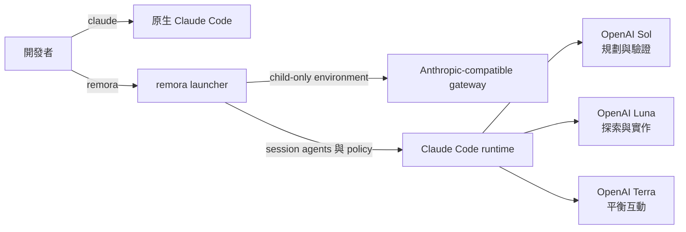

# remora

> 在單一 session 中，讓 Claude Code 使用兼顧成本的 GPT-5.6 agent fleet。

**remora** 以 session-scoped OpenAI model routing、角色 agents 與
orchestration 啟動 Claude Code。Sol 負責規劃與關鍵審查，Luna 負責成本較低的
探索與實作，Terra 則是平衡的互動選項。Child session 結束後，所有 override
都會消失。

[English](./README.md)

## 目錄

- [remora 會改變什麼](#remora-會改變什麼)
- [架構與模型分配](#架構與模型分配)
- [需求](#需求)
- [安裝](#安裝)
- [設定](#設定)
- [使用](#使用)
- [隔離與安全](#隔離與安全)
- [排錯](#排錯)
- [移除](#移除)
- [延伸文件](#延伸文件)

## remora 會改變什麼

> **核心保證：** 直接執行 `claude` 時，原本的 credential、settings、agents
> 與 model routing 完全不變。remora 只影響自己啟動的 child process。

| 介面 | 原生 `claude` | `remora` session |
| --- | --- | --- |
| 指令 | 不變 | 獨立的 `remora` executable |
| 認證 | 既有 Anthropic login | Child-only gateway token |
| Settings | 原本的 Claude hierarchy | Session routing 與可選的 caller settings 合併 |
| Agents | 既有 project／user／plugin agents | 完整八角色 session roster |
| Model fallback | 原本行為 | 停用自動 fallback |
| `~/.claude` 內的檔案 | 不變 | 永不寫入 |
| Runtime marker | 無 | 只在 child 設定 `REMORA_ACTIVE=1` |

大型 Plan 先審核 program envelope，再拆成可獨立批准的 execution slices。
兩次自動 `REVISE` 只會暫停受影響的 readiness unit；無關的 `READY` slice
仍可在明確批准後繼續。預設只先審下一個可執行 slice，取得 `READY` 後就
交給使用者批准，不會預先審完下游 slices。安全敏感的 unit 必須先取得唯讀
security evidence，才能做該 unit 第一次 Plan review。完整規則放在
[架構文件](./docs/architecture.md#role-policy)。

## 架構與模型分配



remora 是 launcher，不是 proxy。你需要自備 Anthropic
Messages-compatible gateway，例如
[CLIProxyAPI](https://github.com/router-for-me/CLIProxyAPI)；protocol
translation、OAuth、retry、cooldown 與 billing 都由 gateway 負責。

| 角色 | 預設模型 | Effort | 責任 |
| --- | --- | ---: | --- |
| Main session | `gpt-5.6-sol` | 使用者指定 | 規劃、決策、整合 |
| `Explore` | `gpt-5.6-luna` | low | 廣域唯讀搜尋 |
| `scout` | `gpt-5.6-luna` | low | 聚焦偵察 |
| `plan-verifier` | `gpt-5.6-sol` | medium | 唯讀 Plan 挑戰 |
| `security-reviewer` | `gpt-5.6-sol` | high | 唯讀安全證據 |
| `mech-executor` | `gpt-5.6-luna` | medium | 機械式實作 |
| `executor` | `gpt-5.6-luna` | max | 需要判斷的實作 |
| `verifier` | `gpt-5.6-sol` | high | 對抗式結果驗證 |
| `security-executor` | `gpt-5.6-sol` | max | 已批准的安全實作 |

| Context 模式 | Claude binary | Client window | 使用時機 |
| --- | --- | ---: | --- |
| `stock` | 官方 Claude Code | 原生 200K custom-model 行為 | 預設 |
| `calico` | 通過驗證的 Calico | Gateway／Codex 較小值 | 明確 opt-in |

Runtime 行為與參考文件：

| 主題 | 契約 | 參考文件 |
| --- | --- | --- |
| Caller settings | 遞迴合併；remora-owned keys 保持 authoritative | [Isolation contract](./docs/architecture.md#isolation-contract) |
| Fallback | 注入 `fallbackModel: []`；拒絕 CLI `--fallback-model` | [Isolation contract](./docs/architecture.md#isolation-contract) |
| Wrapper prompts | `REMORA_COMPOSE_SYSTEM_PROMPT=1` 依序合成 caller 與 remora policy | [Role policy](./docs/architecture.md#role-policy) |
| Context 與 Calico | Metadata 過期或不一致時 fail closed | [Gateway semantics](./docs/architecture.md#gateway-semantics) |
| Active-turn bridge | 實驗性功能，只支援有限 topology | [Gateway runbook](./docs/cliproxyapi.zh-TW.md#實驗性-active-turn-bridge) |

## 需求

| 相依項目 | 需求 |
| --- | --- |
| Claude Code | 支援動態 `--agents` |
| Python | 3.11 以上；只用 standard library |
| Gateway | Anthropic Messages-compatible endpoint 與已設定的 models |
| 平台 | macOS 或 Linux；WSL 尚未測試 |
| 認證 | 環境變數或 OS credential-store command |

## 安裝

### 需要批准的安裝

把固定 tag 的 runbook 交給 Claude Code：

```text
請閱讀並遵循這份安裝 runbook：
https://raw.githubusercontent.com/Nanako0129/remora-cc/v0.1.15/install/AGENT-INSTALL.md

先只執行唯讀 preflight。列出所有預計的檔案變更、trust boundary、
下載來源與驗證步驟。在我明確批准以前，不要寫入任何內容。
```

Runbook 會停在 approval gate，驗證 SHA-256 與 GitHub artifact
attestation，原子化安裝，並確認 `~/.claude` 沒有改變。它不會要求 bearer
token 或 OAuth 檔案。

### 手動 source install

```bash
git clone --branch v0.1.15 --depth 1 https://github.com/Nanako0129/remora-cc.git
cd remora-cc
./install.sh
```

| 安裝路徑 | 用途 |
| --- | --- |
| `~/.local/bin/remora` | Launcher |
| `~/.local/share/remora-cc/` | 版本化 application payload |
| `~/.config/remora-cc/config.toml` | 使用者設定 |
| `${XDG_STATE_HOME:-$HOME/.local/state}/remora-cc/` | Runtime state |

Installer 不會修改 `PATH`；需要時自行加入：

```bash
export PATH="$HOME/.local/bin:$PATH"
```

## 設定

先依照 [CLIProxyAPI 快速部署](./docs/cliproxyapi.zh-TW.md#docker-compose-快速部署)
準備 gateway，再編輯產生的設定：

```bash
${EDITOR:-vi} ~/.config/remora-cc/config.toml
```

臨時 smoke test 可使用環境變數：

```bash
export REMORA_AUTH_TOKEN='replace-me'
remora doctor --online
```

macOS 日常使用建議改從 Keychain 讀取：

```toml
[proxy]
base_url = "http://127.0.0.1:8317"
auth_token_env = "REMORA_AUTH_TOKEN"
auth_token_command = [
  "security",
  "find-generic-password",
  "-a", "YOUR_MACOS_USER",
  "-s", "cliproxyapi",
  "-w",
]
```

環境變數存在時優先；否則 remora 不經 shell，直接執行 credential command。
八角色版本之前建立的設定仍可使用；需要獨立控制 Plan 與 security reviewer
時，依 [`config.example.toml`](./config.example.toml) 補上欄位。

## 使用

```bash
cd ~/src/my-project
remora
remora --continue
remora -p 'summarize this repository'
```

未知參數會原樣交給 Claude Code。明確的 `--model` 或 `--agents` 只會取代
對應的 remora default。`--fallback-model` 會被拒絕，以維持停用自動
fallback；`--` 後的內容完全不動。

Fast 模式是 opt-in 且只作用於目前 session：

```bash
remora --fast --continue
remora dry-run --fast --continue
```

> **注意：** Fast 會向 gateway 要求 `service_tier=priority`，可能增加用量，
> 也不會繞過 provider quota。

| 指令 | 用途 |
| --- | --- |
| `remora doctor` | 驗證 binary、TOML、agents 與 secret retrieval |
| `remora doctor --online` | 額外驗證 gateway models 與 context metadata |
| `remora agents` | 顯示有效角色、model 與 effort |
| `remora render-agents` | 印出完整 `--agents` JSON |
| `remora dry-run --continue` | 顯示不含 token 的 launch preview |

## 隔離與安全

```bash
remora agents
claude --version
```

第一個指令應顯示 OpenAI role map；第二個仍是原生 Claude Code。需要檔案級
證據時，可比較安裝前後的 `~/.claude` SHA-256 manifest。

| 邊界 | 實際約束 |
| --- | --- |
| 原生 Claude | Installer 與 launcher 永不寫入 `~/.claude` |
| Secrets | 不印 token；credential commands 不經 shell |
| Caller settings | 含 secret 的合併 JSON 使用受監控的 `0600` 暫存檔 |
| 安裝 | 固定 release source、checksum、attestation 與 approval gate |
| 移除 | 程式與 runtime state 可移除；預設保留設定 |

> ⚠️ **安全邊界：** Gateway 與上游模型仍會收到 Claude Code 傳送的每個
> prompt 與原始碼。敏感 repository 使用遠端 gateway 前，請先閱讀
> [SECURITY.md](./SECURITY.md)。Managed organization policy 的優先權高於
> remora，也可能改變 fallback 或 role 行為。

## 排錯

| 現象 | 處理方式 |
| --- | --- |
| 所有角色都使用 main model | 執行 `remora doctor`，確認每個 gateway ID 都在 `availableModels` |
| `/resume` 保留舊 model map | 開新 remora session，或 handoff 到新 session |
| 原生 Claude 也使用 gateway | 移除 shell 全域的 `ANTHROPIC_*` |
| 找不到角色 | 移除 explicit `--agents`，或自行合併角色 |
| Context-window error | 更新 Codex metadata，再執行 `remora doctor --online` |
| Gateway cooldown 或 429 | 降低 concurrency、等待 reset 或增加 credential |
| Connectors 停用 | 需要原生 connectors 時改用 `claude` |
| Wrapper prompt 蓋掉 orchestration | 使用 `REMORA_COMPOSE_SYSTEM_PROMPT=1` 啟動 |

> ⚠️ **不要先全域關閉 gateway cooldown。** 真實 upstream rate limit 可能變成
> retry storm。診斷方式與有限的 active-turn 例外請看
> [gateway runbook](./docs/cliproxyapi.zh-TW.md#429-與-cooldown)。

## 移除

```bash
"${XDG_DATA_HOME:-$HOME/.local/share}/remora-cc/uninstall.sh"
"${XDG_DATA_HOME:-$HOME/.local/share}/remora-cc/uninstall.sh" --purge
```

預設保留 `config.toml`；`--purge` 會一併移除。兩種方式都不會碰
`~/.claude`。

## 延伸文件

| 文件 | 用途 |
| --- | --- |
| [Architecture](./docs/architecture.md) | 隔離、啟動流程、角色 policy、context 與相容性 |
| [Gateway runbook](./docs/cliproxyapi.zh-TW.md) | CLIProxyAPI 部署、OAuth、context、active-turn 與 429 |
| [Security policy](./SECURITY.md) | Trust model、secret handling 與通報 |
| [Install runbook](./install/AGENT-INSTALL.md) | Approval-gated 安裝與更新 |
| [Baton compatibility gate](./benchmarks/baton-compatibility/README.zh-TW.md) | 可重現的 two-turn delegation 證據 |

remora 將 [pilotfish](https://github.com/Nanako0129/pilotfish) 的 role-based
orchestration pattern 包裝成 session launcher，也能與
[Baton](https://github.com/cablate/baton) 這類 optional delegation planning
合成；它不宣稱發明 multi-agent routing。

## License

[MIT](./LICENSE)
