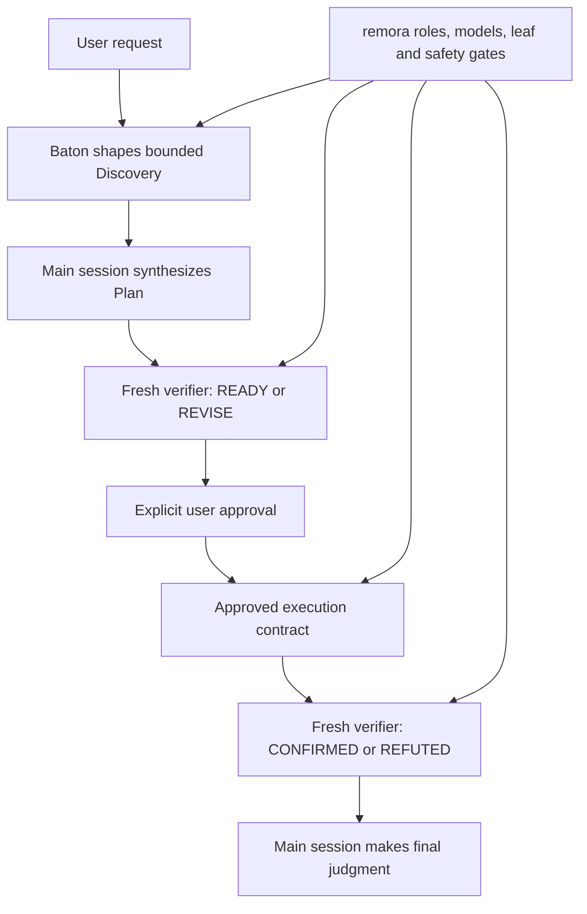

# Baton compatibility gate

## Contents

- [Purpose](#purpose)
- [Composition contract](#composition-contract)
- [Reproduction](#reproduction)
- [Final gate result](#final-gate-result)
- [Rejected candidate](#rejected-candidate)
- [Startup-stall observation](#startup-stall-observation)
- [Limits and disclosure](#limits-and-disclosure)

## Purpose

This experiment tests whether [Baton](https://github.com/cablate/baton) and remora can cooperate through a complete plan-first lifecycle. Baton should select the smallest useful execution topology; remora should remain authoritative for named roles, model routing, leaf-agent boundaries, approval, and verification vocabulary.

> **Gate:** Discovery may reduce uncertainty before the implementation outcome is known, but source writes must wait for a main-session Plan and explicit approval. Plan review uses `READY` / `REVISE`; completed-work review uses `CONFIRMED` / `REFUTED`.

The fixture is the two-surface read-only research control from pilotfish commit [`5f027b8c`](https://github.com/Nanako0129/pilotfish/tree/5f027b8c7701d9acd4ae424a6089ffe3d1fa57a7/benchmarks/dispatch-brake/positive-controls/research). The run used Claude Code 2.1.207 with Calico patches, the v0.1.8 PR candidate, and the installed Baton skill whose `SKILL.md` SHA-256 was `48b1e573a9e3de85fdb68c433bd47d69add9ec8491613ca304cfcef2326e3d67`.

## Composition contract



| Layer | Owns | Must not override |
|---|---|---|
| Baton | Discovery questions, topology, worker count, ownership, sequence, budgets, stop conditions | Named-role model definitions, approval, verifier mode, leaf boundary |
| remora | Named roles, model routing, phase gates, approval contract, verifier vocabulary | Baton's topology judgment inside those gates |
| Main session | Evidence reconciliation, Plan synthesis, integration, final judgment | Required approval or independent verification |

## Reproduction

The test runs only in a disposable Git repository. `--dangerously-skip-permissions` is intentionally scoped to that fixture and is not a recommendation for normal repositories.

```bash
git clone https://github.com/Nanako0129/pilotfish.git /tmp/pilotfish-baton-source
git -C /tmp/pilotfish-baton-source checkout 5f027b8c7701d9acd4ae424a6089ffe3d1fa57a7

WORK="$(mktemp -d /tmp/remora-baton-gate.XXXXXX)"
cp -R /tmp/pilotfish-baton-source/benchmarks/dispatch-brake/positive-controls/research/fixture/. "$WORK/"
git init -q "$WORK"
git -C "$WORK" add .
git -C "$WORK" -c user.name=remora-gate -c user.email=remora-gate@example.invalid commit -qm baseline
cd "$WORK"
```

Turn 1 used this exact task prompt:

```text
Use the installed baton-dispatch skill together with the active remora orchestration policy. This is turn 1 of an explicitly plan-first task. Audit the two independent orchestration surfaces in this repository so you can plan a REPORT.md that determines each surface role roster, model-source rule, delegation eligibility rule, background or foreground behavior, and verifier boundary, with file:line evidence and npm test as acceptance. The outcome of this turn is only one approval-ready Plan synthesized by the main session: include findings, outcome, non-goals, exact write scope, ownership, sequence, verification, budget, and stop conditions. Read-only discovery is authorized, including bounded named read-only agents when Baton finds positive net benefit. Do not create or edit REPORT.md or any source file, do not send an implementation brief, and stop after presenting the Plan for explicit approval.
```

After inspecting the Plan, Turn 2 supplied explicit approval:

```text
核准此 Plan。依上一回合已核准的 scope 與 sequence 執行：只建立 REPORT.md，由主 session 撰寫與整合，跑引用、git scope 與 npm test，最後用新的既有命名 verifier 做 completed-work verification。呼叫命名角色不得傳 model。只有 verifier 回覆 CONFIRMED 且唯一變更是 REPORT.md 才可回報完成；若 REFUTED，依 Plan 最多做一輪限縮修正與新的 fresh verification，仍失敗就停止。
```

The launcher command shape was:

```bash
REMORA_CONFIG=/path/to/test-config.toml remora \
  --dangerously-skip-permissions \
  -p --output-format json --max-budget-usd 3 \
  'TURN_1_PROMPT'

REMORA_CONFIG=/path/to/test-config.toml remora \
  --dangerously-skip-permissions \
  -p --output-format json --max-budget-usd 3 \
  --resume SESSION_ID \
  'TURN_2_APPROVAL'
```

## Final gate result

| Turn | Wall time | Client-reported cost | API turns | Model usage | Result |
|---|---:|---:|---:|---|---|
| Discovery + Plan | 294.102 s | $1.233720 | 35 | Sol + Luna | Git clean; readiness verifier `REVISE` then `READY`; main session presented Plan and stopped |
| Approved execution + verification | 248.304 s | $0.915572 | 10 | Sol only | Only `REPORT.md`; 67 citations valid; `npm test` passed; fresh verifier `CONFIRMED` |
| Total | 542.406 s | $2.149292 | 45 | Sol + Luna | Gate passed without an execution correction cycle |

| Agent call | Scheduling | Invocation `model` | Observed model | Outcome |
|---|---|---|---|---|
| `Explore`: surface A | Background | Omitted | `gpt-5.6-luna` | Read-only evidence returned |
| `Explore`: surface B | Background | Omitted | `gpt-5.6-luna` | Read-only evidence returned |
| `verifier`: Plan readiness | Foreground | Omitted | `gpt-5.6-sol` | `REVISE` followed by `READY` after main-session Plan revision |
| `verifier`: completed report | Foreground | Omitted | `gpt-5.6-sol` | `CONFIRMED` |

| Acceptance check | Result |
|---|---|
| Writes before approval | None; Turn 1 ended with a clean Git tree |
| Plan ownership | Main session |
| Writer topology | Direct main-session work; Baton found no net benefit in reconstructing context for a one-file writer |
| Write scope | `REPORT.md` only |
| Repository test | `REPORT.md covers both independent surfaces with file:line evidence` |
| Citation validation | 67 repository-relative citations existed and stayed within source line ranges |
| Named-role routing | All four Agent calls omitted the invocation-level `model` field |
| Verifier independence | Separate fresh verifier agents handled Plan readiness and completed work; neither wrote files |

Machine-readable data is in [results.json](./results.json). The final raw transcript SHA-256 is `ed92f06f9fe8cdbac3ebc5fdaa607a1beee10c18c51b6ae7f985c40fe14b44e4`.

## Rejected candidate

The first candidate was not counted as a pass. Its Plan verifier brief incorrectly requested completed-work labels, so the role returned `CONFIRMED` / `REFUTED` instead of `READY` / `REVISE`. Completed-work verification then found citation gaps twice before a third verifier confirmed the corrected report.

| Candidate evidence | Value |
|---|---:|
| Turns | 4 user turns |
| Combined wall time | 1,080.0 s |
| Combined client-reported cost | $4.662343 |
| Final state | Report eventually confirmed, but Plan vocabulary gate failed |
| Disposition | Rejected; policy and regression tests were strengthened, then the full gate was rerun in a fresh session |

This failed candidate matters because a dual-mode verifier prompt alone was insufficient: the main-session invocation contract also had to forbid completed-work labels during Plan review. Its raw transcript SHA-256 is `af31d739886ce69a715ab71e4410234cbd42241581d5767c5584747cebf95fcd`.

## Startup-stall observation

The final gate's fresh session created and grew its transcript within the first minute, so it was not resent. Because `-p --output-format json` emits the result only after the turn ends, an empty terminal is not sufficient evidence of a stall.

| Signal | Interpretation | Action |
|---|---|---|
| Transcript continues to gain events | Silent batch work is active | Keep waiting |
| New session has no new transcript events for nearly 10 minutes | Probable startup stall | Terminate that request and resend the same prompt; record both attempts |
| 429, 400, routing error, or terminal failure appears | Request failed, not merely silent | Diagnose the explicit error before deciding whether an unchanged retry is safe |

## Limits and disclosure

> **Do not generalize one passing run into a universal performance claim.** This gate establishes one compatible lifecycle and routing trace, not a population estimate.

| Limit | Consequence |
|---|---|
| Single final run | Timing and cost are observations, not expected values |
| Client-reported cost field | It is not a provider invoice |
| One fixture | Other task shapes may choose direct work, one worker, or different bounded fan-out |
| Policy-based composition | Managed policy, explicit `--append-system-prompt*`, or a contradictory later instruction can still replace the default orchestration addendum |
| Local gateway and Calico runtime | Different gateway translations or Claude Code versions require their own smoke test |
| Raw transcript not committed | It contains absolute home paths and the user's installed-skill inventory; exact prompts, normalized calls, results, content hashes, and fixture commit are published instead |
