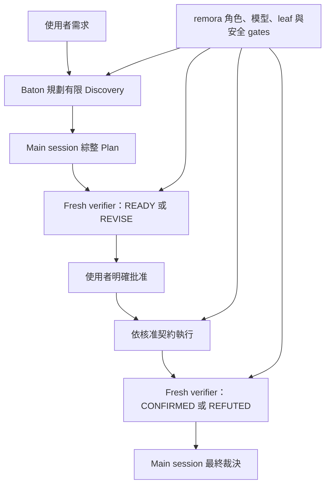

# Baton 相容性 Gate

## 目錄

- [目的](#目的)
- [合成契約](#合成契約)
- [最終 Gate 結果](#最終-gate-結果)
- [被拒絕的候選版本](#被拒絕的候選版本)
- [新 Session 卡住的判定](#新-session-卡住的判定)
- [限制與揭露](#限制與揭露)

## 目的

這項實驗驗證 [Baton](https://github.com/cablate/baton) 與 remora 能否完成真正的 plan-first 生命週期。Baton 負責選擇最小且有淨效益的執行拓撲；remora 繼續唯一掌管命名角色、模型路由、leaf-agent 邊界、批准 gate 與 verifier 詞彙。

> **Gate：** Discovery 可以在最終實作仍未知時降低不確定性，但必須由 main session 綜整 Plan，並在明確批准後才能寫入。Plan review 只使用 `READY`／`REVISE`；成品 review 只使用 `CONFIRMED`／`REFUTED`。

Fixture 來自 pilotfish commit [`5f027b8c`](https://github.com/Nanako0129/pilotfish/tree/5f027b8c7701d9acd4ae424a6089ffe3d1fa57a7/benchmarks/dispatch-brake/positive-controls/research)。執行環境為 Claude Code 2.1.207 加 Calico patch、remora v0.1.8 PR 候選版本，以及 `SKILL.md` SHA-256 為 `48b1e573a9e3de85fdb68c433bd47d69add9ec8491613ca304cfcef2326e3d67` 的 Baton skill。

## 合成契約

| 層級 | 負責項目 | 不得覆寫 |
|---|---|---|
| Baton | Discovery 問題、拓撲、worker 數量、ownership、順序、預算、停止條件 | 命名角色模型、批准、verifier mode、leaf 邊界 |
| remora | 命名角色、模型路由、phase gates、批准契約、verifier 詞彙 | 安全邊界內的 Baton 拓撲判斷 |
| Main session | 證據調和、Plan 綜整、整合、最終裁決 | 必要批准與獨立驗證 |

完整重現指令與兩個原始 prompt 請見 [英文實驗文件](./README.md#reproduction)，機器可讀資料位於 [results.json](./results.json)。

## 最終 Gate 結果

| Turn | Wall time | Client-reported cost | API turns | 模型 | 結果 |
|---|---:|---:|---:|---|---|
| Discovery + Plan | 294.102 秒 | $1.233720 | 35 | Sol + Luna | Git 零寫入；readiness verifier 先 `REVISE`，Plan 修訂後 `READY`；main session 提出 Plan 並停止 |
| 核准後執行 + 驗證 | 248.304 秒 | $0.915572 | 10 | 僅 Sol | 唯一變更為 `REPORT.md`；67 個 citation 有效；`npm test` 通過；fresh verifier `CONFIRMED` |
| 合計 | 542.406 秒 | $2.149292 | 45 | Sol + Luna | 未使用成品修正循環，Gate 通過 |

| Agent 呼叫 | 排程 | Invocation `model` | 實際模型 | 結果 |
|---|---|---|---|---|
| `Explore`：surface A | Background | 省略 | `gpt-5.6-luna` | 回傳唯讀證據 |
| `Explore`：surface B | Background | 省略 | `gpt-5.6-luna` | 回傳唯讀證據 |
| `verifier`：Plan readiness | Foreground | 省略 | `gpt-5.6-sol` | `REVISE` → main session 修訂 → `READY` |
| `verifier`：成品 | Foreground | 省略 | `gpt-5.6-sol` | `CONFIRMED` |

Baton 在執行階段判定單一、判斷密集的 `REPORT.md` 不值得另外派 writer，因此由 main session 直接寫入；沒有為了使用 agent 而強制委派。最終 raw transcript SHA-256 為 `ed92f06f9fe8cdbac3ebc5fdaa607a1beee10c18c51b6ae7f985c40fe14b44e4`。

## 被拒絕的候選版本

第一次候選不能算通過。當時 Plan verifier 的 invocation brief 錯誤要求 `CONFIRMED`／`REFUTED`，沒有使用 `READY`／`REVISE`；後續成品 verifier 也兩次抓到 citation 證據缺口，第三次才確認修正版本。

| 候選證據 | 數值 |
|---|---:|
| User turns | 4 |
| 合計 wall time | 1,080.0 秒 |
| 合計 client-reported cost | $4.662343 |
| 最終成品 | 最後有 `CONFIRMED`，但 Plan 詞彙 gate 失敗 |
| 處置 | 拒絕；加強 policy 與 regression tests，再以全新 session 完整重跑 |

這次失敗證明「verifier 角色 prompt 支援雙模式」仍不夠，main-session invocation 也必須禁止在 Plan review 使用成品詞彙。候選 raw transcript SHA-256 為 `af31d739886ce69a715ab71e4410234cbd42241581d5767c5584747cebf95fcd`。

## 新 Session 卡住的判定

最終 Gate 的全新 session 在第一分鐘內建立並持續增加 transcript event，因此沒有重送。`-p --output-format json` 會等整個 turn 結束才輸出結果，不能只因 terminal 沒字就判定卡住。

| 訊號 | 判定 | 動作 |
|---|---|---|
| Transcript 持續增加 event | 靜默 batch work 正在執行 | 繼續等待 |
| 全新 session 接近 10 分鐘沒有新 transcript event | 可能是 startup stall | 中止該 request，以相同 prompt 重送，並記錄兩次結果 |
| 出現 429、400、routing error 或 terminal failure | 明確失敗，不只是靜默 | 先診斷錯誤，再判定原樣重試是否安全 |

## 限制與揭露

> **不可把單次通過推廣成普遍效能結論。** 這次 Gate 證明一條相容的生命週期與 routing trace，不是母體估計。

| 限制 | 影響 |
|---|---|
| 單次最終 run | 耗時與成本是觀測值，不是期望值 |
| Client-reported cost | 不是 provider invoice |
| 單一 fixture | 其他 task shape 可能選擇 main session、單一 worker 或不同 fan-out |
| Policy-based 合成 | Managed policy、明確 `--append-system-prompt*` 或後續矛盾指令仍可能取代預設 orchestration addendum |
| 本地 gateway 與 Calico runtime | 不同 gateway translation 或 Claude Code 版本仍需各自 smoke test |
| Repo 未提交 raw transcript | 其中含絕對 home path 與使用者已安裝 skill 清單；改為公開完整 prompt、正規化 Agent calls、結果、hash 與 fixture commit |
