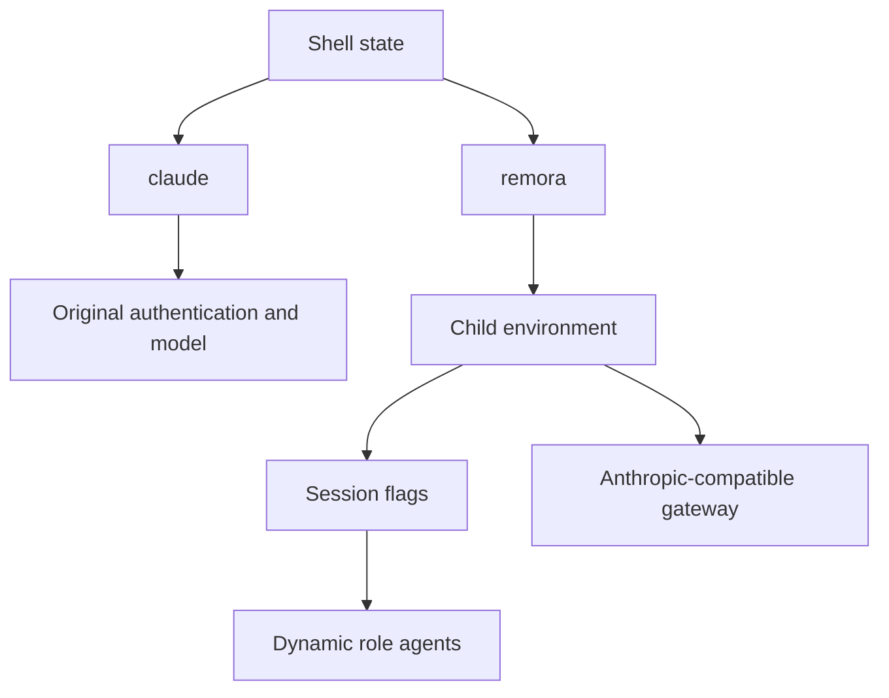
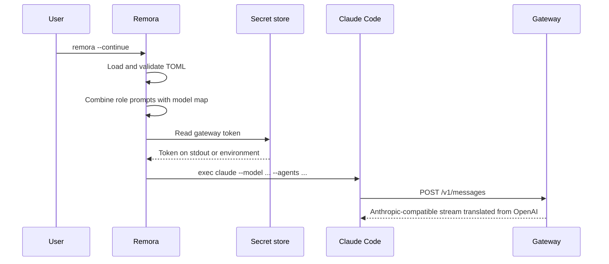

# Remora Architecture

## Design goal

Remora provides a second launch surface for Claude Code. It changes routing for one process tree while preserving native Claude as a fully independent control path.

## Isolation contract

| Boundary | Remora behavior | Why it matters |
|---|---|---|
| Process | Uses `execvpe` with a copied environment | Overrides disappear with the child |
| Settings | Reads no Claude settings and writes none | Native configuration remains authoritative outside Remora |
| Agents | Sends one JSON object through `--agents` | Claude Code scopes it to the current session |
| Authentication | Resolves a Remora-specific token, then sets `ANTHROPIC_AUTH_TOKEN` only in the child | The user's Anthropic login is neither read nor replaced on disk |
| Model defaults | Sets the three documented `ANTHROPIC_DEFAULT_*_MODEL` variables in the child | Internal Claude tiers resolve to gateway model names |
| Global override | Removes `CLAUDE_CODE_SUBAGENT_MODEL` from the copied child environment by default | One global variable cannot collapse every role back to one model |

Claude Code's precedence places dynamic `--agents` below managed agents but above project, user, and plugin agents. A managed organization policy can therefore still prevent or replace a Remora role; Remora deliberately does not bypass managed policy.

## Launch sequence

## Role policy

The split follows capability and token volume rather than file ownership. Read-only fan-out and fully specified mechanical work go to Luna. Work requiring design judgment, independent verification, or security reasoning goes to Sol. Subagents are leaf workers and are denied recursive delegation, preventing an unbounded agent tree.

| Decision | Chosen behavior | Rejected behavior |
|---|---|---|
| Main model | Sol by default | Changing Claude's persistent default |
| Recon | Luna, low effort | Letting built-in Explore inherit Sol |
| Mechanical execution | Luna, medium effort | Paying Sol for deterministic bulk work |
| Verification | Fresh Sol context | Self-review by the implementer |
| Security | Sol, max effort | Cheap routing at a trust boundary |
| Configuration | Model names in TOML | Hard-coded provider catalog in prompts |

## Gateway semantics

Claude Code speaks the Anthropic Messages protocol, while the selected models may be OpenAI models. The gateway owns protocol translation, OAuth, model aliases, cooldown, retries, and account selection. Remora owns none of those concerns; it only chooses the gateway-visible model string for each role.

This separation makes failures diagnosable:

| Error location | Typical evidence | Owner |
|---|---|---|
| Launcher | Invalid TOML, missing token, missing `claude` binary | Remora |
| Claude runtime | Invalid `--agents` field or unavailable tool | Claude Code version/configuration |
| Gateway selector | Millisecond 429 with `model_cooldown` | Gateway state |
| Upstream | Slower 429/5xx after a real network request | Provider/model/account |

## Native-Claude proof

The launcher contains no code path that opens `~/.claude` for writing. Installation targets only XDG-style Remora paths. Tests also assert that clearing a global subagent override mutates only the environment copy passed to the child, not the parent process.

## Compatibility boundary

The design depends on current Claude Code support for `--agents`, agent fields such as `model` and `effort`, and custom gateway environment variables. Remora validates its own shape but cannot guarantee that an arbitrary OpenAI model fully reproduces Claude-specific tool-use, caching, extended-thinking, or context-window behavior. Treat each gateway/model combination as an integration that needs an end-to-end smoke test.
