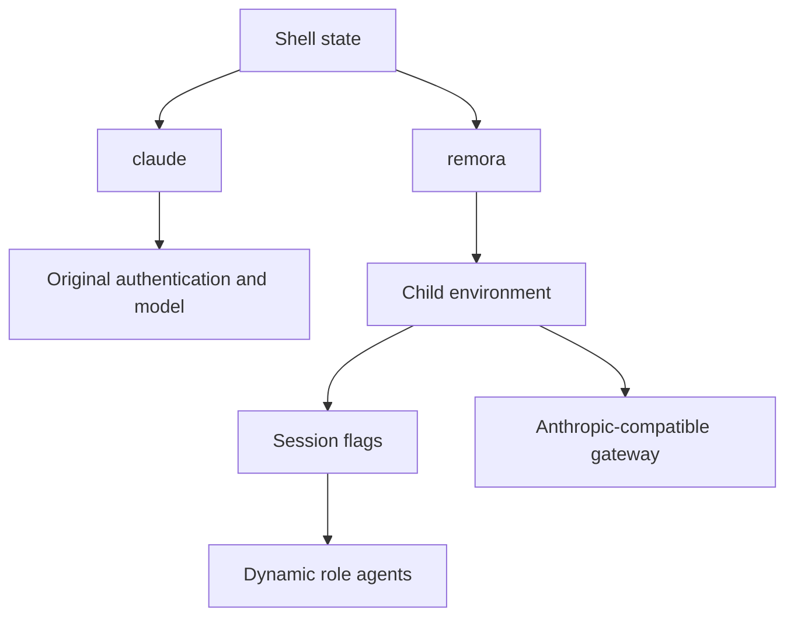
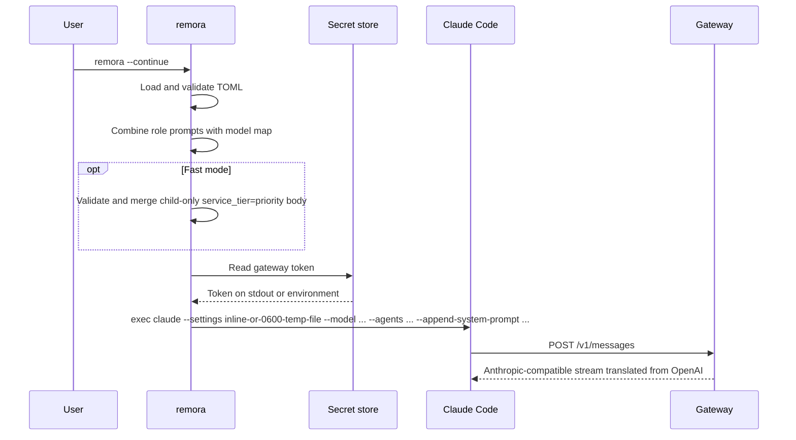

# remora Architecture

## Design goal

remora provides a second launch surface for Claude Code. It changes routing for one process tree while preserving native Claude as a fully independent control path.

```mermaid
flowchart TD
    SHELL[Shell state] --> NATIVE[claude]
    SHELL --> REMORA[remora]
    NATIVE --> ANTHROPIC[Original authentication and model]
    REMORA --> CHILD[Child environment]
    CHILD --> FLAGS[Session flags]
    CHILD --> GATEWAY[Anthropic-compatible gateway]
    FLAGS --> AGENTS[Dynamic role agents]
```

## Isolation contract

| Boundary | remora behavior | Why it matters |
|---|---|---|
| Process | Uses `execvpe` with a copied environment | Overrides disappear with the child |
| Integration marker | Sets `REMORA_ACTIVE=1` in the copied environment | Status lines and hooks can identify remora without inspecting credentials or gateway URLs |
| Settings | Writes no Claude settings; routing-only JSON stays inline, while merged caller settings use a unique `0600` temporary file | Native configuration remains authoritative outside remora without exposing caller JSON in child argv or dry-run |
| Agents | Sends all eight pilotfish-compatible role names in one JSON object through `--agents` | Claude Code scopes them to the current session and shadows same-name user roles |
| Canonical plugin | Sets `enabledPlugins.pilotfish@pilotfish=false` in the session settings | The normally installed Pilotfish plugin cannot add ambient policy or namespaced roles to the remora child |
| Orchestration | Appends a phase-aware dispatch, bounded Plan-readiness, and dependency-scheduling policy | Discovery, Plan, Approval, Execution, and Verification use different stable contracts |
| Runtime evidence | Appends native hook groups only while remora owns the canonical role map and policy | Receipts distinguish configured, observed, skipped, failed, and verified evidence |
| Authentication | Resolves a remora-specific token, then sets `ANTHROPIC_AUTH_TOKEN` only in the child | The user's Anthropic login is neither read nor replaced on disk |
| Caller environment | Removes remora-owned gateway, model, session, Fast, context, concurrency, effort, tool-search, and coralline keys from caller settings `env` | The environment synthesized by `build_launch` remains the runtime source of truth while unrelated caller variables survive |
| Model defaults | Sets the three documented `ANTHROPIC_DEFAULT_*_MODEL` variables in the child | Internal Claude tiers resolve to gateway model names |
| Routing allowlist | Adds every configured gateway id to the session's `availableModels` | Claude does not silently inherit the main model for an excluded subagent id |
| Global override | Removes `CLAUDE_CODE_SUBAGENT_MODEL` from the copied child environment by default | One global variable cannot collapse every role back to one model |
| Optional Fast body | When `--fast` is the first wrapper argument, validates and merges `service_tier=priority` into the copied child `CLAUDE_CODE_EXTRA_BODY` | Fast is session-only and does not mutate the parent environment or persist state |

Claude Code's precedence places dynamic `--agents` below managed agents but above project, user, and plugin agents. remora therefore defines the complete current pilotfish roster, including `plan-verifier` and `security-reviewer`; leaving either name absent would let an installed user-level pilotfish definition remain active. A managed organization policy can still prevent or replace a remora role; remora deliberately does not bypass managed policy.

Claude Code also applies `availableModels` to subagent definitions. In 2.1.207, an excluded custom gateway id silently falls back to the parent model. remora supplies its configured ids as an additional session-only allowlist. When a caller also passes one `--settings` JSON file or inline object, remora recursively merges the caller document first and then overlays its routing allowlist, empty fallback, and exact `pilotfish@pilotfish=false` flag. The same merge preserves unrelated plugin flags, hooks, permissions, and caller variables. Before serialization it requires `env` to be an object and removes keys owned by remora's child gateway/model/session contract. The merged document is written to a unique `0600` temporary file because Claude Code resolves `/dev/fd/N` back to the original pathname and rejects an already unlinked source. Before payload writing begins, remora starts a detached cleanup watcher and retains the write end of a guard pipe across `execvpe`; normal exit, failed launch, or process termination closes that pipe and removes the file. Parent-only path and guard metadata are stripped from the Claude environment. This keeps caller hooks active without losing routing control or placing the full document in the Claude child arguments. Managed policy can still force-enable the plugin, so a live isolation preflight must stop if the effective session reports Pilotfish enabled. Alternate plugin ids and explicit custom plugin directories are outside the canonical installed-plugin guarantee.

## Launch sequence

```mermaid
sequenceDiagram
    participant U as User
    participant R as remora
    participant S as Secret store
    participant C as Claude Code
    participant G as Gateway

    U->>R: remora --continue
    R->>R: Load and validate TOML
    R->>R: Combine role prompts with model map
    opt Fast mode
        R->>R: Validate and merge child-only service_tier=priority body
    end
    R->>S: Read gateway token
    S-->>R: Token on stdout or environment
    R->>C: exec claude --settings inline-or-0600-temp-file --model ... --agents ... --append-system-prompt ...
    C->>G: POST /v1/messages
    G-->>C: Anthropic-compatible stream translated from OpenAI
```

## Role policy

The example configuration sends the main session to Astra and keeps the named role bindings unchanged. Substantial read-only fan-out and fully specified mechanical work go to Luna when their net benefit exceeds startup and synthesis cost. Small bounded repository scans stay with the main session. Independent Plan and outcome review and security work go to Sol; the bounded-judgment executor remains Luna max. `plan-verifier` and `security-reviewer` are tool-allowlisted read-only roles before approval; `verifier` retains command execution for outcome reproduction, while `security-executor` is available only for approved implementation. Subagents are leaf workers and are denied recursive delegation, preventing an unbounded agent tree.

For every existing named role, its `--agents` definition is the sole model source. The orchestrator omits the Agent tool's invocation-level `model` field because Claude Code gives that field higher precedence than the role definition. An explicit invocation model is reserved for a truly ad-hoc agent with no named definition.

Background execution is a parent-orchestrator decision, so it cannot be enforced inside a leaf agent prompt. remora therefore appends a child-session-only policy: every delegation uses `run_in_background: true`, including a result required by the main session's very next action; the parent then waits for and collects that task instead of switching it to foreground execution. Long-running commands remain parent-owned and use the execution tool's native background mode, never shell detachment such as `&`, `nohup`, or `disown`. Explicit user `--append-system-prompt` or `--append-system-prompt-file` arguments replace this default unless `REMORA_COMPOSE_SYSTEM_PROMPT=1`; in that opt-in mode remora reads either caller source, accepts separated values beginning with `-`, stops scanning at `--`, places caller content before the orchestration policy, and forwards one inline append prompt. Agent SDK callers that would otherwise overwrite the CLI prompt during their initialize protocol can pass the caller text through the child-only `REMORA_CALLER_SYSTEM_PROMPT` bridge; remora consumes and removes that variable before launching the runtime.

## Orchestration runtime evidence

The launcher appends Remora-owned `UserPromptSubmit`, `SubagentStart`,
`SubagentStop`, `Stop`, and `SessionEnd` command groups to compatible caller
hooks. The command and argument are separate exec-form values: the absolute
Python interpreter and installed sibling `src/orchestration_runtime.py`.
Existing hook groups stay in order. Registration is omitted when hooks are
disabled, Claude Code support is unknown or older than 2.1.196, the caller
selects a custom root agent or replacement roster, or the canonical policy is
replaced rather than composed.

The runtime hashes native `prompt_id`, session and agent identifiers. It stores
no prompt, response, final child text, raw identifier, transcript path or
credential in receipts. Root and child transcripts are bounded, read without
following symlinks beneath the configured Claude projects root, and checked for
ownership, writable permissions and identity changes. Model and effort are
observations from persisted assistant records; configured values never fill a
missing observation. An async launch also needs a linked, completed
`TaskOutput`. Source, role, policy, prompt, parent/child or completion drift
keeps the receipt `SKIPPED` or `FAILED`.

Risk-triggered Plan review uses an exact two-line task prefix:
`readiness_review`, then `automatic_plan_review:<native-prompt-hash>`.
Only a completed, linked `plan-verifier` with exact bare `READY` or structured
four-field `REVISE` supplies review-service evidence. `REVISE` never grants
readiness or write authority. Missing evidence can block root Stop once per
blocker fingerprint; it does not accept a Plan or grant approval.

State lives in the Remora XDG state root under `orchestration/`, with private
directories, bounded atomic files and a nonblocking advisory lock. The runtime
keeps at most 128 session states, 64 child events per prompt, and one latest
receipt per known role and contract. `SessionEnd` removes only that session
state. After affected sessions have ended, abandoned states may be cleared by
removing only `${XDG_STATE_HOME:-$HOME/.local/state}/remora-cc/orchestration/sessions/*.json`
while Remora is not running. `remora orchestration-status` reads sanitized
receipts without a model call. For isolated fixtures, invoke
`python3 src/orchestration_runtime.py --verify` with explicit root transcript,
child transcript, projects root, role, model, effort and prompt ID arguments;
it prints a receipt or writes only to an explicit private output directory and
never updates live latest-receipt state. This mechanism is a workflow guard and
evidence recorder, not a security sandbox; it does not resist a process with
the same filesystem privileges, override managed hook policy, or prove hook
firing from configuration alone.

Scheduling begins only after the current phase's dispatch brake. Discovery needs a stable question, allowed scope, evidence format, and stop condition; it does not require a pre-decided implementation outcome. The main session reconciles evidence and synthesizes one Plan. Large, architectural, risky, or explicitly plan-first work then waits for explicit approval before any implementation brief or source edit. Execution requires stable scope, exclusive ownership, constraints, done criteria, integration, and verification. Completed-work verification starts only when there is a concrete integrated claim to refute.

### Adaptive route and review intent

The policy chooses `execute` for clear bounded work, `explore_then_plan` for
broad or high-impact work, and `co_discover` for an open-ended idea. The route
records `intent_confidence`, five-band `change_impact`, `reversible`, a
`discovery_budget` with `budget_exhausted`, `evidence_sufficient`, bounded
`blocking_decisions`, and `next_gate`. Pre-approval discovery is read-only;
`next_gate=approval` stops before execution, and no exhausted budget grants
write authority. The default discovery bands are `none` (0 units), `minimum`
(1-2), `bounded` (up to 6 plus one cheap read-only probe), and `deep` (up to
10 plus two read-only probes).
`change_impact` means trivial/no-write, low/isolated reversible,
material/module or user-behavior boundary, high/migration or release, and
critical/destructive, external, or security-sensitive work.

Material product, authority, risk, irreversible-cost, or unresolved-direction
choices use the actual main-session `AskUserQuestion` tool when it is exposed;
plain text cannot substitute for that call. If the tool is unavailable, the
policy fails closed with `PAUSED_NEEDS_USER`, one concise question and choices,
a recommendation, and the exact resume point.

The internal card follows `pilotfish-decision-checkpoint-v1` and contains exactly
`checkpoint_id`, `scope`, `current_interpretation`, `impact`,
`recommended_option`, two or three `options`, `excluded_scope`,
`affected_task_ids`, `resume_point`, and `approval_boundary`. Each option has an
`id`, `label`, and concrete `effect`. Claude's card receives only supported
question and option fields; the full record stays internal. Exact option numbers
or ids resume only the affected tasks, while rejection or ambiguous free text
keeps them pending.

`review_intent` is turn-scoped and independent of `task_mode`: clear explicit
`fast`, `default`, or `strict` cues are accepted, while ambiguous, quoted,
negated, conflicting, and vague cues use `default`. Mandatory security, risk,
approval, review, permission, release, destructive, irreversible, and external gates
precede that preference. `fast` skips only optional review; `strict` completes
the primary path and may use a read-only same-fingerprint
`semantic_adjudication` only when that capability already exists. remora emits no optional auto-review signal or
scheduler and never uses a write-capable executor as a reviewer.

`semantic_adjudication` gives the read-only `plan-verifier` exactly two anonymous
Luna verdicts for one input fingerprint and resolves only their semantic
disagreement. It neither repairs missing evidence nor resolves deterministic
probe conflicts. The existing bare `READY` or structured `REVISE` payload remains
unchanged, and the fingerprint stays in surrounding metadata. Adjudication
cannot satisfy `automatic_plan_review`, approval, or execution; this policy change adds
no scheduler, parser, gate, or receipt runtime.

At a `direction_checkpoint`, the verifier returns exactly `CONTINUE`, `PIVOT`,
`ROLLBACK`, or `INCONCLUSIVE`. These direction-only dispositions cannot satisfy
outcome verification, readiness, or approval; `outcome_verification` keeps its
existing `CONFIRMED`, `REFUTED`, or `INCONCLUSIVE` vocabulary. Insufficient
evidence is `INCONCLUSIVE`. `ROLLBACK` requires an available verified target and
cannot describe an irreversible external action; the verifier reports the
limitation and required containment or user decision instead. This contract is
policy guidance, not deterministic runtime enforcement.

Plan and outcome verification use deliberately different roles, capabilities, and vocabularies. Independent review is triggered by concrete security, irreversible or external, data, migration, release, or cross-component acceptance risk, not by file count or “non-trivial” alone. Large work still uses a program envelope plus independently approvable slices, but only triggered units require `READY`. `REVISE` returns all known claim-relevant P0-P2 blockers in one pass; P3/P4, optional detail, and adjacent hardening do not block. After two automatic revisions, the main session stops automatic resubmission and dispositions every blocker as `FIX`, `DEFER`, or `REJECT`. One materially changed unit may receive one final fresh readiness pass; another `REVISE` pauses or escalates it. Independent slices continue. User input is reserved for unresolved P0/P1, product or authority choices, or an original scope that can no longer be met. `READY` remains readiness evidence rather than approval, and security-sensitive units still complete read-only `security-reviewer` evidence before readiness.

Outcome verification starts with the primary acceptance flow and stays calibrated to the exact claim, returning `CONFIRMED`, `REFUTED`, or `INCONCLUSIVE`. Role verdicts are evidence rather than implementation or scope authority; the main session owns `FIX`, `DEFER`, and `REJECT` dispositions. `REFUTED` still requires a reproducible P0-P2 blocker, P3/P4 remain advisory, and introduced P2 regressions remain blocking. Normal recovery is one targeted recheck of the original reproduction plus a bounded regression. Five materially changed P1/P2 passes remain an emergency ceiling for high-risk, claim-critical recovery, never a quota; stop earlier when another pass would only search adjacent risk. Long autonomous work declares `AUTO` or `ASK`; neither mode expands user authority.

Within each phase's safety boundary, remora makes a net-benefit decision across model cost, scarce context, elapsed time, isolation, and independent verification versus reconstruction, coordination, and synthesis. A slight direct-work speed advantage is therefore not a veto when a bounded Luna worker materially saves Sol usage.

A role match remains an eligibility hint, not a command to spawn. Root-cause discovery, trace-driven debugging, and state-propagation work stay in the main session while diagnosis and implementation depend on the same evidence; a single unknown bug must not become a sequential scout-to-executor pipeline. Read-only repository fan-out is opt-in and requires substantial per-surface work, overlapable latency, or intentionally independent perspectives. Separate directories and roughly a dozen short files are not enough. Executors receive work only after the root cause, scope, ownership, and done criteria are stable enough for a one-shot brief; stable multi-file repetition remains a positive path to `mech-executor`.

Recurring work has no numeric delegation trigger. Remaining items are batched only when they are independent, the same shape, and fully specified by one stable brief with ownership and per-item acceptance. A diagnosed review finding with a known remedy is eligible Execution work, but delegation remains conditional; diagnosis, exceptions, integration, and final acceptance stay in the main session.

Risk-triggered completed-work outcome verification runs at the smallest coherent integration boundary where the complete slice claim can be refuted. Tests and builds are intermediate evidence, while security, FFI, serialization, pre-aggregation, irreversible, and integration-blocking changes verify earlier. A missing review receipt gets one bounded retry, then the affected gate enters `WAITING_FOR_REVIEW` or `PAUSED_VERIFICATION`; blocked sibling tasks do not stop unrelated runnable work. Completed recon output is collected from the tracked task, and continuation is reserved for liveness, redirection, or genuinely new work.

A listed [Baton](https://github.com/cablate/baton) skill is invoked once before
the direct-work or lifecycle choice for large, cross-surface, research-heavy,
or genuinely separable work. It chooses the smallest topology and may still
select direct work. remora remains the authority for named roles, model routing,
leaf-agent boundaries, approval, and the separate verifier roles; Plan
synthesis, integration, and final judgment remain in the main session.

The backend-neutral guardrails follow the shared [pilotfish orchestration policy and evidence](https://github.com/Nanako0129/pilotfish), whose field observations came from remora sessions routed to GPT-5.6 and do not establish provider-independent numeric thresholds. The existing [remora + Baton compatibility gate](../benchmarks/baton-compatibility/README.md) validates the base role composition and lifecycle but predates these bounded Plan-readiness controls; deterministic policy and payload tests lock the new contracts without relabeling that older run.

| Decision | Chosen behavior | Rejected behavior |
|---|---|---|
| Main model | Astra in the example config; caller passes `--effort low` | Adding a persistent main-effort setting |
| Recon | Luna, low effort | Letting built-in Explore inherit Sol |
| Mechanical execution | Luna, medium effort | Paying Sol for deterministic bulk work |
| Plan review | Read-only Sol `plan-verifier` | Reusing the command-capable outcome verifier before approval |
| Verification | Fresh Sol context | Self-review by the implementer |
| Security | Read-only Sol review before approval; Sol execution after approval | Giving pre-approval evidence work to a write-capable role |
| Configuration | Model names in TOML | Hard-coded provider catalog in prompts |
| Context safety | Read the gateway ceiling, reserve output space, and scope auto-compaction to the child | Pretending every provider route has the public API's maximum window |

## Gateway semantics

Claude Code speaks the Anthropic Messages protocol, while the selected models may be OpenAI models. The gateway owns protocol translation, OAuth, model aliases, cooldown, retries, and account selection. remora owns none of those concerns; it only chooses the gateway-visible model string for each role.

Fast mode is the same narrow boundary: remora optionally injects
`service_tier=priority` into the copied child `CLAUDE_CODE_EXTRA_BODY`, while the
gateway remains responsible for accepting, translating, billing, and enforcing
that request option. It applies to every request in that child session only,
is off by default, and may consume additional provider credit or usage. Stock
CLIProxyAPI v7.2.80 was verified; this is a compatibility check, not a minimum
version claim or a quota bypass. `remora dry-run --fast ...` exposes only a
sanitized synthesized body so inherited fields are not disclosed.

Codex active-turn continuity also crosses this boundary. Native Codex preserves server-issued turn state across tool continuations, but the stock CLIProxyAPI Claude bridge does not currently retain that state. This can make a remora turn stop at a subscription allowance boundary before native Codex would stop under backend fair-use rules. The confirmed source evidence, responsibility split, non-solutions, and acceptance test are documented in [Preserving Codex Active-Turn Fair Use Through the Claude Bridge](./codex-active-turn-fair-use.md).

Context capacity crosses that boundary: the gateway catalog describes its route, while ChatGPT-authenticated Codex can replace the bundled model catalog with remotely supplied runtime metadata. Those two sources temporarily diverged at 372K and 272K. Stock Claude Code also assigns unknown custom model ids a separate 200K client window. remora's default `stock` policy therefore reports the truthful 200K window and leaves Claude's native compact pipeline untouched. The optional `calico` policy queries `/v1/models?client_version=remora`, reads only fresh model metadata from the local Codex cache, and takes the smaller per-model value before supplying an exact child-only map to a separately verified Calico binary. It then reports 95% usable context and applies the 90% compact ratio exactly once. Discovery is read-only, uses a 272K TOML fallback for the Codex ceiling, and never rewrites either catalog.

Compact product policy is the same ownership split. remora only marks the child with
`REMORA_ACTIVE=1` and owns when auto-compact may fire; a verified Calico binary may
then rewrite compact body effort/thinking/optional model under that marker and emit
`x-calico-request-source: compact`. A compatible CLIProxyAPI build may apply an
absolute wall-clock and single-shot stream retries for that class only, without
rewriting product fields. remora does not inject `CALICO_COMPACT_*` or gateway
`streaming.compact` keys; see [CLIProxyAPI integration](./cliproxyapi.md#compact-request-hardening-calico--gateway).

This separation makes failures diagnosable:

| Error location | Typical evidence | Owner |
|---|---|---|
| Launcher | Invalid TOML, missing token, missing `claude` binary | remora |
| Claude runtime | Invalid `--agents` field or unavailable tool | Claude Code version/configuration |
| Gateway selector | Millisecond 429 with `model_cooldown` | Gateway state |
| Upstream | Slower 429/5xx after a real network request | Provider/model/account |

## Native-Claude proof

The launcher contains no code path that opens `~/.claude` for writing. Installation targets only XDG-style remora paths, and runtime integration files stay under `${XDG_STATE_HOME:-$HOME/.local/state}/remora-cc/`. Tests exercise a real launcher-to-fake-Claude exec, assert that `~/.claude` remains byte-identical, and verify that clearing a global subagent override mutates only the environment copy passed to the child, not the parent process.

## Compatibility boundary

The design depends on current Claude Code support for `--agents`, agent fields such as `model` and `effort`, and custom gateway environment variables. remora validates its own shape but cannot guarantee that an arbitrary OpenAI model fully reproduces Claude-specific tool-use, caching, extended-thinking, or context-window behavior. Treat each gateway/model combination as an integration that needs an end-to-end smoke test.
